# Wazuh Detection Pack | Linux detection engineering lab

**[English](#english) | [Español](#español)**

---

## English

A personal home lab for learning detection engineering on Wazuh, end to end. I read what an adversary does, turn it into a rule, check that the rule fires, check that it stays quiet on normal activity, and write down how someone could evade it.

This is lab work, not production or client work, and it has no affiliation with Wazuh.

Status: phase 1 is done (infrastructure and 4 custom rules validated). Phase 2, rules driven by a threat group (TeamTNT), is in progress: 10 of 10 techniques have rules and 28 phase 2 rules are written. See the [roadmap](#roadmap).

### What this project shows

- A working Wazuh 4.14.8 deployment on AWS with a monitored Ubuntu endpoint (auditd telemetry).
- Thirty-two custom Wazuh rules mapped to MITRE ATT&CK so far, each with a positive test, a negative test and a documented evasion.
- A gap in Wazuh's own ruleset: a stock rule at level 0 silences every Python execution, which I found because the event was in auditd and never reached the dashboard (see [The Python gap](#the-python-gap)).
- Mistakes I caught by checking claims against the primary source or against my own tests, including predictions I got wrong (see [Findings](#findings) and [Phase 2 findings](#phase-2-findings)).
- What each rule misses and where it gives false positives.
- Three of the detections rewritten as portable Sigma rules, after checking what SigmaHQ already covers (see [Sigma versions](#sigma-versions)).

### Lab architecture

```
 Endpoint (Ubuntu 24.04)                         Server (Ubuntu 24.04)
 auditd + Wazuh agent  --- 1514/1515 (private IP) --->  Wazuh 4.14.8 all-in-one
 endpoint-linux-01                                      manager + indexer + dashboard
                                                                 ^
                                              dashboard (443) and SSH (22): my ISP's /24 only
```

| Component | Detail |
| --- | --- |
| Cloud | AWS, us-east-1, paid with account credit |
| Server | Ubuntu Server 24.04 LTS, t3.xlarge (4 vCPU, 16 GB), 50 GiB gp3 |
| Wazuh | 4.14.8 all-in-one, installed with the official installation assistant |
| Endpoint | Ubuntu Server 24.04 LTS, Wazuh agent 4.14.8, agent name `endpoint-linux-01`, small instance (t3.small class), 20 GiB gp3 |
| Agent to server | Over the server's **private IP**, so it does not change when instances are stopped and started |
| Telemetry | Linux Audit (`auditd`), `execve` syscalls of my user, read by the agent from `/var/log/audit/audit.log` |
| Cost guard | AWS Budget with an email alert, set before launching anything |

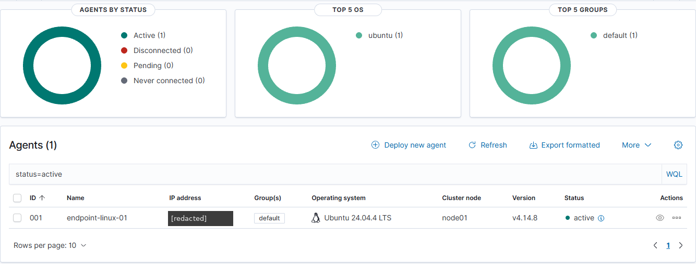

#### Network decisions (security group)

- SSH (22) and HTTPS (443): only from my ISP's `/24` block. My public IP changed between three different addresses of the same block in under two hours, so a single `/32` kept locking me out. This is a conscious trade-off: less strict than `/32`, far stricter than `0.0.0.0/0`.
- 1514-1515 (agents): only from the security group itself.
- Never `0.0.0.0/0`.

### Rules

All rules chain from Wazuh's stock rule **80792** ("Audit: Command"), which classifies any command run under the `audit-wazuh-c` key. That base rule has no MITRE mapping and does not tell a harmless `ls` from something suspicious, so the custom rules add that context.

| ID | Level | What it detects | ATT&CK |
| --- | --- | --- | --- |
| 100100 | 8 | `whoami`, `id`, `w`, `who` (user discovery) | T1033 |
| 100101 | 10 | `cp`, `mv` or `ln` on those binaries (staging a copy to rename it) | T1036.003 |
| 100102 | 7 | Any binary executed from `/tmp`, `/var/tmp` or `/dev/shm` | T1036.003 |
| 100103 | 3 | The same four commands run as root with no terminal (login noise, downgraded and not silenced) | none |

Full file: [`rules/local_rules.xml`](rules/local_rules.xml).

<details>
<summary>Show the three rules</summary>

```xml
<group name="local,audit,">
  <rule id="100100" level="8">
    <if_sid>80792</if_sid>
    <field name="audit.command" type="pcre2">^(whoami|id|w|who)$</field>
    <description>Audit: User discovery command executed: $(audit.command) by auid $(audit.auid)</description>
    <mitre>
      <id>T1033</id>
    </mitre>
    <group>audit_command,discovery,</group>
  </rule>
</group>

<group name="local,audit,">
  <rule id="100101" level="10">
    <if_sid>80792</if_sid>
    <field name="audit.command" type="pcre2">^(cp|mv|ln)$</field>
    <regex type="pcre2">\sa[1-9]="/usr/bin/(whoami|id|who|w)"</regex>
    <description>Audit: Binary used for user discovery copied, moved or linked: $(audit.execve.a1) $(audit.execve.a2)</description>
    <mitre>
      <id>T1036.003</id>
    </mitre>
    <group>audit_command,defense_evasion,</group>
  </rule>
</group>

<group name="local,audit,">
  <rule id="100102" level="7">
    <if_sid>80792</if_sid>
    <field name="audit.exe" type="pcre2">^/(tmp|var/tmp|dev/shm)/</field>
    <description>Audit: Binary executed from a temporary directory: $(audit.exe)</description>
    <mitre>
      <id>T1036.003</id>
    </mitre>
    <group>audit_command,defense_evasion,</group>
  </rule>
</group>
```

</details>

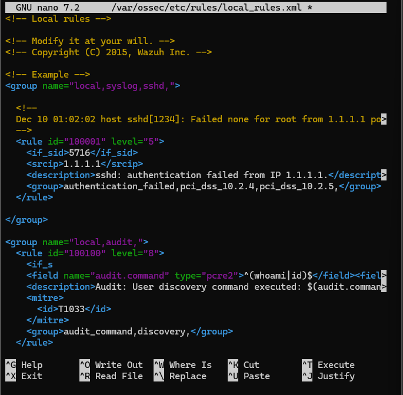

#### Design choices

- Custom rule IDs in the 100000-119999 range, so they never collide with stock rules.
- Level 8 for 100100, not 12: a lone `whoami` is a hint, not proof of compromise.
- `auid` instead of `uid` in the audit rule: `auid` is the login user and survives `sudo`, so privilege escalation does not hide the command.
- Workflow before every change: back up `local_rules.xml`, validate with `/var/ossec/bin/wazuh-analysisd -t`, only then restart the manager.

### Validation results

| Test | Result |
| --- | --- |
| `whoami`, `id` | Fires 100100 |
| `ls`, `date` | Does not fire. Control: the base rule 80792 did fire, so the events reached the server |
| `who`, `w` | Fires 100100 (after extending the rule, see Findings) |
| `cp /usr/bin/id /tmp/idc` | Fires 100101 |
| `cp /etc/hostname /tmp/h` | Does not fire (negative test) |
| `cp /usr/bin/whoami /tmp/wm`, then `/tmp/wm` | Does **not** fire 100100 (evasion). Fires 100102 |

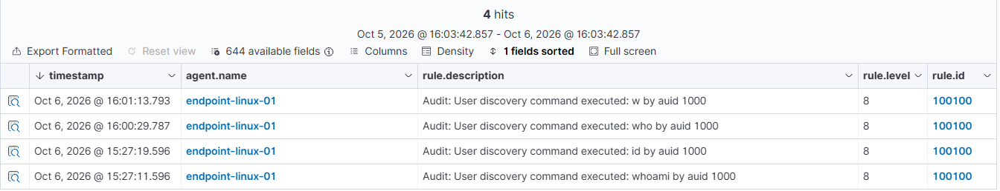

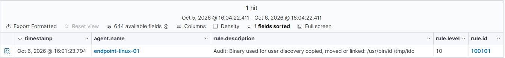

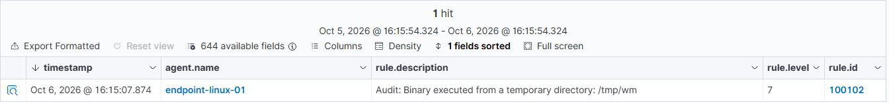

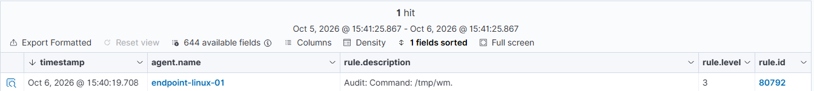

A negative result only counts when a control proves the event arrived. Every "does not fire" above was checked against rule 80792.

### Findings

1. **Coverage gap in my first version.** Rule 100100 v1 covered only `whoami` and `id`. The official T1033 page also lists `w` and `who` for Linux. v2 includes them.
2. **Renaming defeats a name-based rule.** In the alert for `/tmp/wm`, `audit.command` is `wm` while `audit.exe` is `/tmp/wm`. A filter on the command name misses a renamed copy; the path does not. That is what 100102 uses.
3. **Wazuh and ATT&CK disagree on names for the same ID.**

   | | Wazuh 4.14.8 (alert) | ATT&CK (official page, v19) |
   | --- | --- | --- |
   | T1036.003 name | Rename System Utilities | Rename Legitimate Utilities |
   | Tactic | Defense Evasion | Stealth (TA0005) |

   The ID matches, so the mapping is right. My hypothesis, **not verified**, is that Wazuh ships an older ATT&CK dataset. Practical rule: map by ID, never by name, and check the primary source.
4. **Login noise.** Every SSH login, even a non-interactive `ssh host command`, ran `who`, `id` and `id` as root with no terminal, and rule 100100 flagged them at level 8 when I had typed nothing. I added 100103, a child rule that drops root-without-terminal to level 3 instead of silencing it. The trade-off is that someone running `sudo id` over a non-interactive SSH session also lands at level 3. A command I type myself over SSH still fires 100100 at level 8. My guess is that system login scripts run these commands; I did not confirm the parent process.
5. **Alert time is not execution time.** The `timestamp` of an alert is when the server processed the event, 20 to 30 seconds after the command in my lab. The real time is in the auditd record.

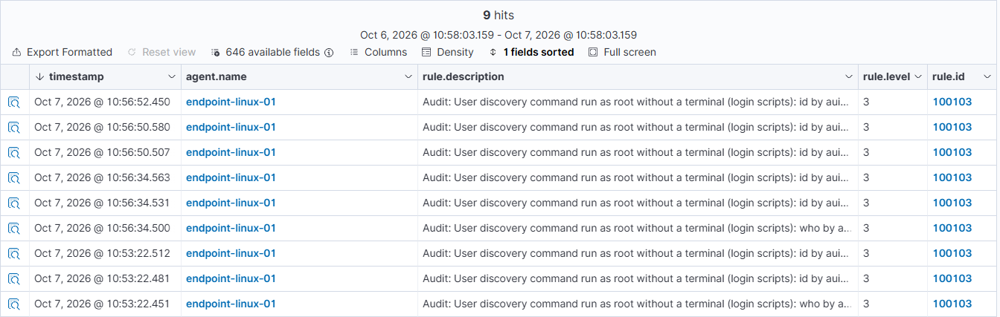

### Known limitations

- 100100 flags `id` every time, and scripts and admins run it constantly. In a real environment this is noisy. 100103 only lowers the login-script part of that noise.
- 100101 detects the staging step (the copy), not the use of the renamed binary.
- 100102 has false positives (installers, `snap`, legitimate scripts) and is evaded by executing from another folder.
- No rule uses `tty` or `ppid` yet to separate interactive use from scripting.
- Tested on a single endpoint, only with my own commands. False-positive rate is not measured.

### Phase 2: TeamTNT (ATT&CK G0139)

I picked TeamTNT because it goes after Linux and cloud workloads (exposed Docker, Kubernetes, AWS credentials), which is what auditd on a Linux box can actually see. The technique list comes from the ATT&CK group page (v19) and Unit 42's analysis of Hildegard, a TeamTNT campaign. It lives in [`phase2/teamtnt-techniques.md`](phase2/teamtnt-techniques.md), together with the behaviors my lab cannot see. I have not checked every ID against its own technique page yet.

For each technique I write down what I expect before testing, run a positive test, a negative test with a control, and at least one evasion, then write a v2 for the evasions I can close. When a prediction turned out wrong I kept it in the write-up.

Progress: all 10 core techniques have rules. Most rules chain from the stock rule 80792; the Python ones hang from the stock rule 92600.

| ID | Level | What it detects | ATT&CK |
| --- | --- | --- | --- |
| 100110 | 4 | `curl` or `wget` executed (baseline) | T1105 |
| 100111 | 10 | `curl` or `wget` with a temporary directory in the arguments, including options fused to the path (`-o/tmp/x`, `--output-document=/tmp/x`) | T1105 |
| 100112 | 8 | `curl` or `wget` run with a temporary directory as working directory (relative output paths) | T1105 |
| 100120 | 9 | `curl` or `wget` pointing at the instance metadata service (IP as text, decimal, hex or octal) | T1552.005 |
| 100121 | 12 | The same, asking for `security-credentials` (the IAM role keys) | T1552.005 |
| 100130 | 3 | Any Python execution (the stock rule hides them at level 0) | T1059.006 |
| 100131 | 9 | A Python process that references the metadata service | T1552.005 |
| 100132 | 12 | A Python process that asks for `security-credentials` | T1552.005 |
| 100133 | 10 | `ufw disable` or `ufw reset` (the ufw script runs as Python) | T1562.004 |
| 100140 | 8 | `masscan`, `zmap`, `zgrab` or `zgrab2` by binary name | T1046 |
| 100141 | 10 | `tmate` by binary name | T1219 |
| 100150 | 5 | `iptables`, `ip6tables` or `ufw` executed | T1562.004 |
| 100151 | 10 | The same with `-F`, `--flush`, `disable` or `reset`. Rate limited with `ignore="60"` | T1562.004 |
| 100152 | 8 | `chattr` executed | T1222.002 |
| 100153 | 8 | `useradd` or `adduser` that ran successfully | T1136.001 |
| 100160 | 10 | A write to `authorized_keys` (append or file replacement) under a watched `.ssh` directory | T1098.004 |
| 100161 | 10 | The `.ssh` directory itself moved or deleted | T1098.004, T1070.004 |
| 100162 | 10 | An audit rule with a Wazuh key was removed (watch dropped or auditing tampered with) | T1562.012 |
| 100163 | 12 | Auditing switched off (`auditctl -e 0`) | T1562.012 |
| 100170 | 10 | A systemd unit file created or deleted directly under `/etc/systemd/system` | T1543.002 |
| 100171 | 6 | `systemctl enable`, `reenable` or `link` | T1543.002 |
| 100180 | 12 | `/etc/ld.so.preload` created, written, replaced or deleted | T1574.006 |
| 100190 | 10 | A file directly under `/var/log` deleted or renamed by a session with a real `auid`. Rate limited with `ignore="60"` | T1070.002, T1070.004 |
| 100191 | 10 | A file directly under `/var/log` opened with `O_TRUNC` by a session with a real `auid` | T1070.002 |
| 100192 | 10 | `truncate` or `shred` with a path under `/var/log` | T1070.002 |
| 100200 | 10 | A shell history file (`.bash_history`) deleted or renamed | T1070.003 |
| 100201 | 10 | A shell history file opened with `O_TRUNC` | T1070.003 |
| 100202 | 8 | `rm`, `shred`, `truncate`, `ln`, `mv` or `unlink` naming a shell history file | T1070.003 |

#### T1105: tools downloaded with curl and wget (100110, 100111, 100112)

A bare `curl` is normal, so 100110 is only a level 4 baseline. The level goes up when the arguments point at a temporary directory (100111) or the process runs from one (100112). Test URL: `https://example.com`.

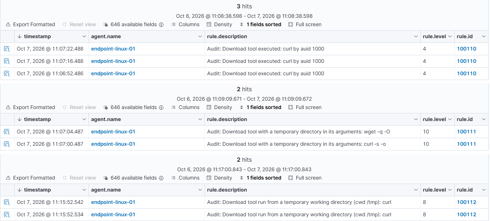

| Test | Result |
| --- | --- |
| `curl -s -o /tmp/t1 URL` | 100111, level 10 |
| `wget -q -O /tmp/t4 URL` | 100111, level 10 |
| `curl -s URL` from my home directory | 100110 only, level 4 |
| `ls /tmp` | Nothing. Control: 80792 fired |
| `cd /tmp && curl -s URL -o t2` | v1: 100110 only. v2: 100112, level 8 |
| `curl -s URL -o/tmp/t3` | v1: 100110 only. v2: 100111, level 10 |
| `wget -q --output-document=/tmp/t5 URL` | 100111, level 10 |
| `curl -s URL > /dev/null` run from `/tmp` | 100112, level 8 (accepted false positive) |

What v1 missed: 100111 only matched an argument that started with `/tmp/`. A relative output path with `/tmp` as the working directory, and an option fused to the path, both got through. v2 widens the regex to allow an option prefix, and 100112 looks at the working directory (`audit.cwd`). It is level 8 and not 10 because running from `/tmp` is a weaker signal than writing there explicitly. A `curl` that only prints to the screen from `/tmp` still fires it, and I accepted that.

Still evades: output to a directory outside my list (`~/.cache`, `/run/lock`), other download clients, and a renamed binary.

#### T1552.005: instance metadata service (100120, 100121, 100130 to 100132)

On EC2, the service at `169.254.169.254` hands out the temporary credentials of the instance's IAM role. TeamTNT used it to go from a shell on a server to the AWS account, so I tested it on my real instance.

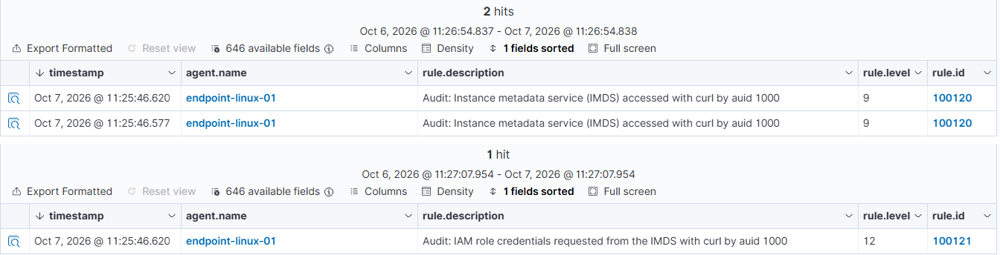

| Test | Result |
| --- | --- |
| `curl http://169.254.169.254/latest/meta-data/` | 100120, level 9 |
| IMDSv2 token request (`PUT .../api/token`) | 100120, level 9 |
| `curl .../iam/security-credentials/` | 100121, level 12 |
| `curl https://example.com` | 100110 only, level 4 |
| Same IP written as decimal (`2852039166`) | v1: 100110 only. v2: 100120, level 9 |
| Hex (`0xa9fea9fe`) and octal (`0251.0376.0251.0376`) | 100120, level 9 |
| Mixed form (`169.16689662`) | 100110 only, level 4. Residual evasion |
| Python `urlopen` to the metadata service | v1: no alert at all. See the next section |

The instance already required IMDSv2 tokens: a plain request from Python got HTTP 401. The rules log the attempt whether or not it succeeds. The real prevention is the AWS setting (require tokens, hop limit 1), and the detection is the second layer.

#### The Python gap

The Python request was in the audit log (`ausearch` showed it with the right key) and never became an alert. How I tracked it down:


1. auditd had the event, so the loss was somewhere between the log and the dashboard.
2. A controlled 2x2 test. `python3 --version` (Python, no parentheses) raised no alert. `ls "(1)"` (parentheses, no Python) did. So it was about Python, not about odd characters in the arguments.
3. I searched the stock ruleset for the word python. Rule 92600 in `0850-audit_rules.xml` has level 0 and matches any `audit.exe` containing "python". Its children are 92601 (script run from `/tmp`, level 6) and 92602 (Impacket signature, level 12). Wazuh silences generic Python on purpose, because it is noisy, and only alerts when a child matches.
4. The fix is a set of rules that hang from 92600 instead of from my curl and wget chain (100130, 100131, 100132).

| Test | Result |
| --- | --- |
| `python3 -c "print(1)"` and `python3 --version` | 100130, level 3 |
| `python3 -c` with `urlopen` to the metadata service | 100131, level 9 |
| Same, to `security-credentials` | 100132, level 12 |
| `python3 /tmp/x.py` | Stock 92601, level 6. Confirms Python events go through that chain |

Limit: a script run from `/tmp` is reported as 92601, not as the metadata rule. Also, auditd hex-encodes arguments that contain spaces, and I do not know whether the agent decodes them. The Python rules carry both the text and the hex form of the strings they look for. They fired in my tests, but I did not check which branch matched.

#### T1046 and T1219: scanners and tmate (100140, 100141)

I did not install the real tools. I used harmless copies of `/usr/bin/true` named `masscan`, `zmap` and `tmate`, so these tests only prove the name match.

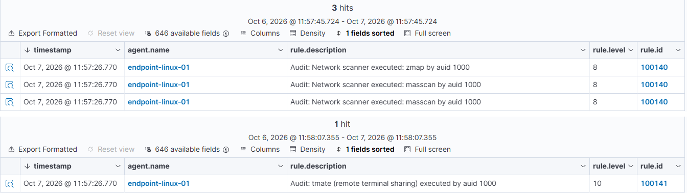

| Test | Result |
| --- | --- |
| `masscan` and `zmap` | 100140, level 8 |
| `tmate` | 100141, level 10 |
| A copy renamed to `scanner` | No custom rule, only 80792 at level 3. Evasion confirmed |
| `ls ~/bin` | Nothing from the custom rules |
| The `masscan` copy executed from `/tmp` | 100140 (level 8), not 100102 (level 7). My prediction was wrong |

#### Firewall, chattr and local accounts (100150 to 100153)

Three rules that match a command name, so they were quick to write. They also taught me the most about how one command turns into many events. In Wazuh 4.14.8 I used `T1562.004` for the firewall technique, the older ID. ATT&CK v19 calls it `T1686`.

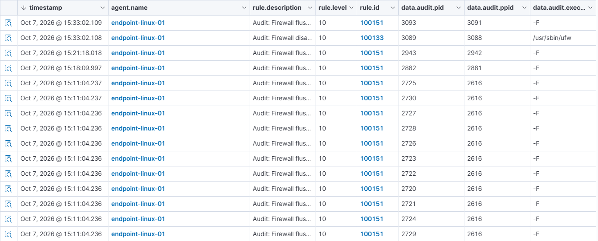

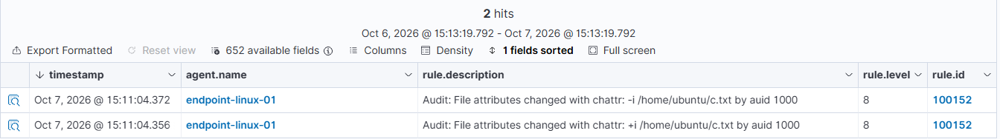

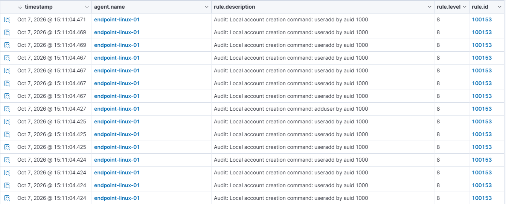

| Test | Result |
| --- | --- |
| `sudo iptables -F` | 100151, level 10, one alert |
| `sudo iptables -P INPUT ACCEPT` | 100150 only, level 5. Evasion: it opens the firewall without a flush or a disable |
| `sudo iptables -L` | 100150, level 5 |
| `sudo ufw disable` | v1: one 100130, about 100 hits of 100150 and 65 of 100151. v2: one 100133 (level 10), one 100151 (level 10) and 162 of 100150 (level 5, 63 of them `-F`) |
| `sudo chattr +i` and `-i` on a test file | 100152, level 8, two alerts |
| `lsattr` | Nothing |
| `sudo useradd ...` | v1: 7 hits in 100153. v2: 1 hit |
| `sudo adduser ...` | v1: 8 hits. v2: 2 hits (`adduser` and the real `useradd` it launches) |

#### SSH authorized_keys and tampering with the audit itself (100160 to 100163)

Every rule so far looked at a command. This one looks at an effect: someone writes to `authorized_keys`, with any tool. That needs an auditd file watch (`-w <path> -p wa -k audit-wazuh-w`). The stock rule 80780 already maps that key to "write access", so I hung my rules from it. There is a second reason to use a watch: `echo 'key' >> authorized_keys` is a shell builtin, and the event came out with `comm=bash` and no `echo` process, so the rules that look at commands could never see it.

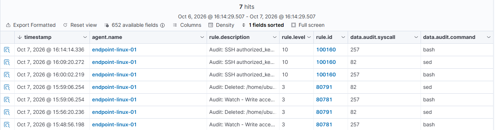

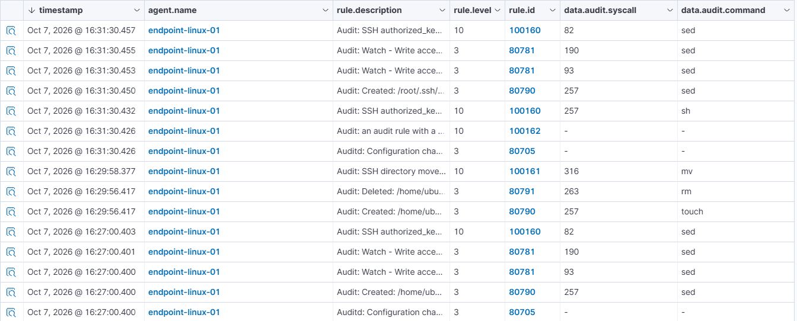

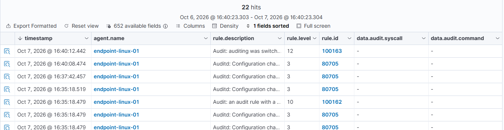

My predictions before testing: the append alerts, the read does not, and `sed -i` escapes the watch because it replaces the file instead of writing to it. The last one was wrong, and so were a few later ones. They are all in the table and in the findings.

| Test | Result |
| --- | --- |
| `cat authorized_keys` | Nothing. The watch is `wa` (write and attribute), not read |
| `echo 'key' >> authorized_keys` | 100160, level 10 (`openat`, `comm=bash`). Before the rule existed, the stock rules gave 80781 at level 3 |
| `sed -i` on the file | 100160, level 10 (`rename`). My prediction was wrong: the watch does see a file replacement. I also misread my own dashboard filter for a while (I looked for 80782, the stock alert was 80791) |
| Watch on the file, then `mv ~/.ssh ~/.ssh.old`, new directory, `cp`, `echo >>` | The kernel dropped the watch (`CONFIG_CHANGE op=remove_rule` in the audit log) and nothing written afterwards was logged. Wazuh only showed 80705 (level 3, "Configuration changed"). Evasion confirmed |
| Same, with a watch on the directory | The move shows as 80791 (level 3). The watch stays attached to the old directory: writes in the new one are invisible, writes in the renamed old one are logged. I had predicted it would follow the new directory |
| v2: `mv ~/.ssh ~/.ssh.old3` with the watch armed | 100161, level 10 |
| v2: `auditctl -W` on the watch | 100162, level 10. `auditctl -w` (adding it back) gives 80705 only, which is the negative control |
| `touch` and `rm` of a file inside `.ssh` | 80790 and 80791, level 3. No 100161 |
| Watch on `/root/.ssh`: append and `sed -i` with `sudo` | 100160 both times (`auid` stays 1000 through `sudo`) |
| Reloading the rules with `augenrules --load` (the `-D` at the top of `audit.rules` removes everything first) | Four 100162 (level 10), one per rule removed, plus 80705 for the additions. It is also what a manual `auditctl -D` would look like |
| `auditctl -e 0` | 80705 at level 3 only. A hole: 100162 looks for `remove_rule` and this is another operation. v2: 100163 (level 12) on `op=set audit_enabled=0` |
| `auditctl -e 1` when auditing is already on (control) | 80705 only, no 100163 |

The watches are saved in `auditd/wazuh-files.rules` (loaded with `augenrules --load`), next to `auditd/wazuh-cmds.rules` with the `execve` rules. After a reboot `auditctl -l` showed them all again, and again after the `audit=1` change (finding 12).

#### systemd services (100170, 100171)

TeamTNT left a unit under `/etc/systemd/system` to survive a reboot. It is the same family as `authorized_keys` (a file gets written), with one difference: creating the file activates nothing. A second step, `systemctl enable`, does that, and it touches other places.

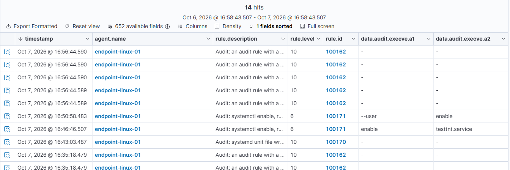

My predictions: the unit file alerts at level 10, `systemctl enable` only shows up as the command at level 3, the symlink that `enable` creates is invisible (I assumed because directory watches are not recursive, and that reason was wrong, see finding 12), and a user unit in `~/.config/systemd/user/` escapes everything. The four outcomes held, but the reason I gave for the symlink was wrong.

| Test | Result |
| --- | --- |
| `sudo tee /etc/systemd/system/testtnt.service` | 100170, level 10. `tee` is a real process, so the command rules also saw it at level 3 |
| `systemctl daemon-reload` and `systemctl enable` | Only 80792 at level 3, the command. `ausearch` found 0 lines for the symlink in `multi-user.target.wants/`, so auditd never logged it. I first read that as "directory watches are not recursive", which was wrong (finding 12): without `audit=1` on the kernel command line, the symlink that systemd (PID 1) creates is not audited at all |
| Evasion: a unit in `~/.config/systemd/user/`, written with `printf >` and enabled with `systemctl --user enable` | No 100170. Only 80792 at level 3. Evasion confirmed |
| v2: `sudo systemctl enable` | 100171, level 6 |
| v2: `systemctl --user enable` | 100171, level 6, on the second run. The first run reached auditd and never became an alert (finding 13) |
| Control: `systemctl --user is-enabled` | 80792 only, no 100171 |
| `systemctl disable`, user and system | No 100171 |
| `sudo rm /etc/systemd/system/testtnt.service` | 100170, level 10. The rule matches the file name and does not tell a creation from a deletion |
| Noise | Each `systemctl --user` call also logs systemd's own helpers (`30-systemd-environment-d-generator`, `systemd-xdg-autostart-generator`) as 80792 at level 3 |

#### /etc/ld.so.preload (100180)

The dynamic linker reads this file and loads every library it lists into every process that starts, so one line makes each program on the machine run the attacker's code. It is technique 9 of my TeamTNT list (T1574.006, Dynamic Linker Hijacking). On a clean Ubuntu 24.04 the file does not exist, which makes any change to it unusual and lets the rule use a high level.

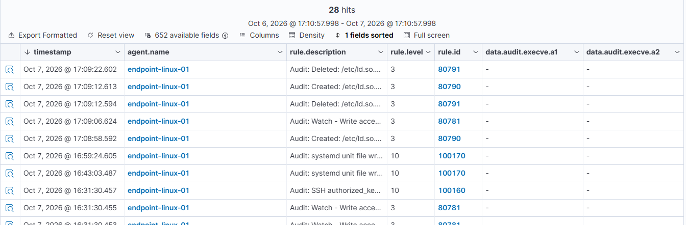

My predictions: auditd accepts a watch on a file that does not exist yet, creating it alerts, the watch survives a delete and a recreate, and replacing the file with `mv` is still seen. All four held. I did not predict the fifth thing: the stock rules already alerted, at level 3.

| Test | Result |
| --- | --- |
| `auditctl -w /etc/ld.so.preload` while the file is absent | Accepted (exit 0), listed by `auditctl -l` |
| `sudo touch` (create), before the rule | 80790, level 3 |
| `: > /etc/ld.so.preload` (truncate), before the rule | 80781, level 3. A truncate logs neither CREATE nor DELETE |
| `rm`, then `touch` again, before the rule | 80791 and 80790, level 3. The watch kept working |
| Same operations with 100180 loaded: `touch`, truncate, `mv` of a temp file over it, `sed -i`, `rm` | Five events in auditd, five alerts of 100180 at level 12, no stock alert next to them |
| Evasion: write `/tmp/lsp` and `mv` it over the file | 100180. The event has three `PATH` records with the name: `CREATE` for the new file and `DELETE` for the old one and for the temp file |
| Evasion: `sed -i` | 100180. `sed` builds its temp file inside `/etc` and renames it over the original |
| Control: `touch` and `rm` of `/etc/ld.so.preload.bak` | Nothing. It is not watched and the regex wants the exact name |
| Reboot with the watch in `wazuh-files.rules` | `auditctl -l` showed both `execve` rules and the four watches, `auditd` and the agent were active |

#### Log deletion (100190 to 100192)

Technique 10 of my TeamTNT list: deleting or emptying logs to hide what happened (T1070.002, clearing Linux system logs, and T1070.004, file deletion). The watch is on the directory: `-w /var/log -p wa`.

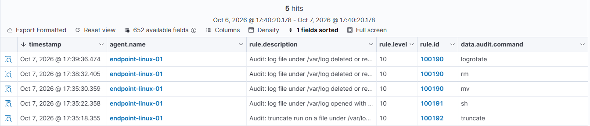

This one was a lesson in how little the file side tells you. A directory watch logs every open for write of its direct children, so the stock rules already alert on `touch`, `tee -a`, `truncate`, `mv` and `rm`, all at level 3, and nothing separates an attacker from `apt` or a login. I measured it: in about 5 minutes of normal admin work (a forced `logrotate`, an `apt install` and `remove`, one SSH login) the watch logged 181 events with a real `auid`, and only the daemons (`rsyslogd`, `sysstat`) had it unset. So `auid` alone is a bad filter. The login itself (`sshd`) carries the user's `auid`. What separates the cases is the operation: `dpkg`, `sshd` and `rsyslogd` only open files, while deleting, renaming and truncating came from `logrotate` (99 `rename` and 4 `unlink` in one forced run) and 2 `unlink` from `apt-get`. So the rules ask for a real `auid` plus a destructive operation.

Three rules, because one hole cannot be closed on the file side: `truncate -s 0` opens the file with `O_WRONLY|O_CREAT|O_NONBLOCK` (`a2=841`, no `O_TRUNC`) and empties it with a separate `ftruncate` call, and the watch only logs the open. 100190 is delete and rename, 100191 is an open with `O_TRUNC` (the bit `0x200` of `a2`, matched in the raw hex), and 100192 is the command rule for `truncate` and `shred`.

My predictions went wrong twice. I expected the directory watch to be blind to truncating and appending, and I expected `sshd` to log no user id. I also said `O_TRUNC` would identify truncation, which is false for `truncate -s 0`.

| Test | Result |
| --- | --- |
| `touch` and `tee -a` on a test file under `/var/log` | Only the stock 80790 and 80781, level 3. No new rule |
| `truncate -s 0` | 100192, level 10, from the command. The file side logged an open with `a2=841` and stayed at 80781, level 3 |
| `sh -c ': > file'` | 100191, level 10. Open with `O_TRUNC` |
| `mv` of the file to another name in the same directory | 100190, level 10 |
| `rm` of the file, 65 seconds after the previous 100190 | 100190, level 10 |
| `logrotate -f`, 65 seconds after the previous 100190, about 100 destructive events | One alert of 100190, level 10. I did not count what the rest turned into |
| `apt-get install` and `remove` | No new rule. The `unlink` of `/var/log/apt/eipp.log.xz` stayed at 80791, level 3, because the regex only takes files directly in `/var/log` |
| First attempt, all commands inside 20 seconds | Only the `mv` alerted. `ignore="60"` silenced the `rm` and the `logrotate`. My test was badly built and I redid it with 65 second gaps |

#### Shell history (100200 to 100202)

The second half of technique 10: hiding what an intruder typed by clearing the shell history (T1070.003). I started with what the shell does with the file, before writing anything, using a nested interactive shell and a test file (`~/.testtnt_hist`) so that my own history was not touched.

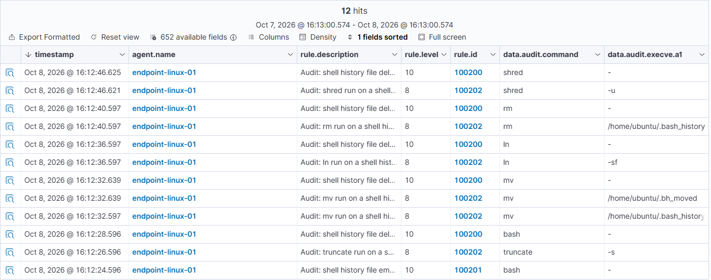

The result is that most of the techniques leave nothing to detect. `history -c` only clears the session in memory: Ubuntu's `.bashrc` sets `histappend`, so the old lines stay in the file and only that session's commands are lost. `unset HISTFILE` and killing the shell with `kill -9 $$` also keep the commands out of the file. None of the three leaves an event, because they are shell builtins or a signal: no `execve`, no file opened. What Wazuh can see is the destruction of a history that already exists. For that I put watches on `/home/ubuntu/.bash_history` and `/root/.bash_history`. A normal logout produced two events from `bash`, an `openat` with `O_WRONLY|O_APPEND` and a `chown`, so alerting on deletion and `O_TRUNC` does not fire on a logout. The three rules follow the same split as the log rules: 100200 for deletion and rename, 100201 for an open with `O_TRUNC`, and 100202 for the command, which is the only layer that sees `truncate -s 0` (it opens without `O_TRUNC`). `cp` is not in the command list on purpose, because a backup copy of the history would alert.

My predictions held except one: I expected `history -w` to alert as a truncation (100201) and it came out as 100200.

| Test | Result |
| --- | --- |
| Nested shell, `echo uno; echo dos` | The file holds both lines |
| `history -c` | The file keeps the old lines, only the session's commands are lost. No event |
| `unset HISTFILE`, `kill -9 $$` | The commands are not saved. No event |
| `truncate`, `shred -u`, `ln -s /dev/null`, `rm` on the test file, before the rules | Only 80792, level 3 |
| A normal logout with the watch on | Two events from `bash` (open for append, `chown`). No rule fires |
| `: > ~/.bash_history` | 100201 |
| `truncate -s 0 ~/.bash_history` | 100202 only |
| `history -w` | 100200. I predicted 100201. The audit event is a `rename` of a temporary file (`.bash_history-<pid>.tmp`) over the original, followed by a `chown` |
| `mv` away and back | Three alerts: 100202 for the first `mv`, 100200 for the move, 100202 for the second `mv` (the history file is its destination) |
| `ln -sf /dev/null ~/.bash_history` | 100200 and 100202 |
| `rm` of that symlink | 100200 and 100202 |
| `shred -u` | 100200 and 100202, one of each although `shred` renames the file several times |
| `cp -p` to restore from my backup | No alert |

#### Phase 2 findings

1. **When two sibling rules match, the higher level won.** I assumed the first rule in the file wins. In my first test, `/tmp/masscan` matched 100102 (level 7, higher up in the file) and 100140 (level 8) and came out as 100140. In the second, a copy of `curl` in `/tmp` matched 100102 (level 7) and 100110 (level 4, lower in the file) and came out as 100102. Both results fit "highest level wins" and neither fits file order. That is two observations, I did not read the engine's code, and I did not test ties.
2. **The stock ruleset has intentional blind spots.** Rule 92600 hides all Python. Reading what the base ruleset does with an event, before assuming it reaches my chain, would have saved me a round.
3. **Three kinds of evasion showed up.** Different spelling of the same thing (decimal IP, option fused to the path, relative path), a different tool for the same job (Python instead of curl), and renaming the binary. Only the first kind can be closed with a better regex.
4. **An event existing in the source does not mean an alert exists.** The audit log is the first place to look when something is missing from the dashboard.
5. **One command can be many events.** A single `useradd` produced 7 alerts. In the process tree (`pid` and `ppid`), one process had six children that auditd also logged as `useradd`. `ausearch -p <pid> -i` showed what they were: failed `execve` calls (`success=no`, `ENOENT`) of `/usr/sbin/sss_cache`, a helper that is not installed on my instance. v2 requires `success=yes`, matched as text in the raw event because I had not verified the name of the decoded field. The cost is that a failed attempt to run a tool no longer alerts on that rule. I only applied it to 100153.
6. **`ufw disable` needed two fixes, and one of them was a trade-off.** A single run produced about 100 alerts of 100150 and 65 of 100151 (level 10), mostly ufw's own `iptables` calls. `ufw` is a Python script, so its own event shows up under 100130. Rule 100133 hangs from there and reports `ufw disable` or `ufw reset` as one alert at level 10, which is the line an analyst should read. Separately, I added `ignore="60"` to 100151. Result for one `ufw disable`: one alert of 100133, one of 100151 (down from 65), and 162 of 100150, all children of the same process (`ppid`), created within about 40 ms. The 63 `-F` calls that `ignore` silenced in 100151 showed up as 100150 at level 5, so they were demoted rather than dropped. That is what I saw in the data, I did not read the engine's code. The costs: `ignore` applies to the whole rule, not per host or per process, so a real `iptables -F` inside the 60 second window shows up at level 5 instead of 10. And I did not fix 100150: 162 level 5 alerts for one admin command is noise, and I decided to leave it as context for investigation, with the actionable alert in 100133. I have not verified `ignore` in the documentation.
7. **The decoded file name is the first `PATH` record, not the file.** A `sed -i` event has five `PATH` records, and `wazuh-logtest` showed `audit.file.name` as the parent directory (`/home/ubuntu/.ssh/`). A rule that compared that field would have missed the replacement. Matching the raw text (`name="…/.ssh/authorized_keys"`) worked, so that is what the rules do. `wazuh-logtest` was the tool that showed it: paste an event and read the three phases.
8. **A watch on a path is a watch on an inode.** The inode numbers made it visible: the directory I armed at 19:14 is now `.ssh.old2` (inode 295508), and the live `~/.ssh` is a different one (295521). Writing into the old one is logged, writing into the new one is not. For the file watch the audit log says it outright. That the kernel removed it by itself when the parent moved is my reading of that record, I did not read the kernel source. I saw this on kernel 7.0.0-1013-aws.
9. **The evasion leaves two fingerprints, and they are different events.** The move of the directory (100161) and the vanished watch (100162). Neither one repairs anything: after a 100161 alert the watch is blind until someone arms it again by hand, and whatever gets written in between is lost. I wrote rules for the fingerprints because I could not close the hole itself.
10. **A dashboard filter hid an alert.** For `CONFIG_CHANGE` events Wazuh decodes `audit.key` as `null`, so my filter `data.audit.key:audit-wazuh-w` never showed the 80705 alerts for the dropped watch, and I called it a gap before checking by rule ID. The logtest run fixed the diagnosis. Now I filter by `rule.id` when I want to know whether something alerted.
11. **Switching auditing off is logged, switching it back on is not.** After `auditctl -e 0` the audit log has `op=set audit_enabled=0 old=1` and no line for the `-e 1` that followed. My reading is that with auditing off there is nowhere to write the change, I did not check the kernel. So that alert is the last thing the endpoint reports until someone turns auditing back on, and it arrived as 80705 at level 3 until I wrote 100163. The real control is not a rule: immutable mode (`-e 2` at the end of the rules) refuses the change until a reboot. I did not enable it in the lab, because every rule change would need a reboot.
12. **The `systemctl enable` symlink was invisible because of who creates it, not where.** I first wrote that a directory watch does not see inside subdirectories, and that was wrong. A regular file created in a subdirectory of `/var/log` or of `/etc/systemd/system` was logged, and so was a symlink I made by hand with `ln -s` inside `multi-user.target.wants/`. What did not show up was the symlink that `systemctl enable` creates, because PID 1 (systemd) is the one creating it. The evidence: `/proc/cmdline` had no `audit=1`; `systemctl --root=/ enable`, which does the work inside the `systemctl` process, was logged; and after adding `audit=1` and rebooting, the normal `systemctl enable` was logged too, with `proctitle=/sbin/init`. My reading is that processes that exist before auditing is on, PID 1 among them, get no audit context unless `audit=1` is set at boot, so what they do is not audited. That mechanism is from memory and I did not check the kernel documentation. The consequence for detection: on a stock cloud image the file watches do not see what systemd does by itself, and the command rule 100171 was the only trace of an enable. I only tested PID 1, I did not check other processes that start before auditd.
13. **Restarting the manager disconnects the agent, and I lost one event I could not explain.** The agent log has five "Lost connection with manager" lines at 18:59, 19:26, 19:39, 19:42 and 19:46 UTC. Those match, as far as I can tell from the order of the session, the times I restarted the manager after each rule. The agent is offline for around 10 seconds or more each time. The delay of 20 to 30 seconds I measured in earlier tests may be the same thing, but that is a guess. Separately, one `systemctl --user enable` (19:46:47) is in the audit log with its arguments and never became an alert, while the events right before and after it did, and the agent had already reconnected. I could not find the cause. Run again a few minutes later, it alerted. Since then I wait about 30 seconds after a restart before testing.
14. **A command rule is cheap to write and cheap to evade.** 100171 catches `systemctl enable` for a unit wherever it lives, but I did not test creating the symlink by hand with `ln -s`, which never goes through `systemctl`. It is a second layer on top of the file watch and not a replacement for it.
15. **A watch on a file that does not exist yet works, and it survives a delete and a recreate.** `auditctl -w /etc/ld.so.preload` returned 0 on a system where the file is absent, and the later create, truncate, delete, `mv` and `sed -i` were all logged. The audit records list the parent directory (`/etc/`) as a `PARENT` item, so my reading is that the kernel keeps the watch on the parent plus the name. That differs from finding 8, where what I watched was a directory and it got swapped. I did not read the kernel source.
16. **The stock rules already saw it. What I added is severity and a mapping.** Before 100180 the same operations alerted as 80790, 80781 and 80791 at level 3, and their descriptions already named the file. Level 3 is where nobody looks. Also, the file I recreated got inode 2986, the one `testtnt.service` had had a few minutes earlier, so an inode number does not identify a file over time.
17. **The `ignore` window can ruin a test.** 100190 has `ignore="60"`. In my first run I fired `mv`, `rm`, `logrotate` and `apt` inside 20 seconds, and only the `mv` alerted. For a minute I could not have told "the rule does not work" from "the rule is silenced". The fix was to leave 65 seconds between the cases.
18. **The audit log shows flags in hex without `0x`, and adds readable fields at the end of the line.** `a2=841` in the raw line is `0x841`, and the line ends with `SYSCALL=openat AUID="ubuntu"`. My first `grep` for `0x241` found only itself, because auditd also logs the arguments of the `grep`. A rule on the open flags has to match the hex digits as text.
19. **A history that is never written cannot be protected with a rule, only with configuration.** The three ways of keeping commands out of the file leave no event at all, and the only thing detectable is the destruction of a history that exists. The command telemetry is a second record the user cannot edit from the shell, which is why 100202 and the other command rules keep working after the history is gone, with the exception of builtins.
20. **`history -w` alerted as a deletion and not as a truncation, and I had predicted the opposite.** The audit event shows why: bash writes a temporary file (`.bash_history-<pid>.tmp`), renames it over `.bash_history` (a `rename` with `DELETE` for the old file and `CREATE` for the new one) and then runs `chown` on it. It is a replacement, not a truncation. The level is the same (10) and a user can run it legitimately, so I count it as a known false positive. The watch kept working after the replacement, like in finding 15.
21. **`audit=1` alone lost 61 events at boot, and a bigger backlog fixed it.** After adding `audit=1`, `auditctl -s` showed `lost 61` (it had been 0 before). It did not grow when I forced a `logrotate`, about 100 events at once, and the kernel log shows the boot-time audit records coming from systemd loading BPF programs before `auditd` is up. That fits a queue that is only 64 events long until `auditctl` raises it to 8192. Adding `audit_backlog_limit=8192` to the kernel command line and rebooting gave `lost 0`. It is one boot against one boot and I did not count how many events the boot produces, so the cause is the best fit and not a proof. The file watches work either way, but a detection pack should look at `lost` in `auditctl -s`: an event that was lost is a detection that cannot exist.

#### Phase 2 limits

- Rules that match a binary name (100140, 100141) are evaded by renaming it. Behavior (mass outbound connections) is the better signal, and it needs another data source.
- Nothing here sees a client that is not `curl`, `wget` or Python. Network-level monitoring, VPC flow logs, CloudTrail or GuardDuty would be the other layers; my lab does not cover them.
- Scanners were tested with stand-ins, not the real tools.
- The metadata rules also match an IPv6 form and the `instance-data` hostname, but I did not test those.
- Tested only with my own commands on one endpoint. The false-positive rate is not measured.
- For the firewall technique I swapped `T1686` (ATT&CK v19) for `T1562.004`, which Wazuh validates. I have not confirmed that Wazuh rejects `T1686`.
- `iptables -P INPUT ACCEPT` opens the firewall and is not caught by 100151.
- 100133 only sees `ufw disable` and `ufw reset`. Anyone who skips ufw and calls `iptables` directly goes through 100151, which has the rate limit.
- The watches cover `/home/ubuntu/.ssh` and `/root/.ssh` only. Other users, and a different `AuthorizedKeysFile` in `sshd_config`, are not covered.
- After a directory swap the watch stays blind until it is armed again. 100161 and 100162 tell you, they do not repair it. Wazuh active response could re-arm it, but I did not try.
- While auditing is off nothing is recorded, and 100163 is the last thing the endpoint reports. Immutable mode (`-e 2`) would prevent it and I did not enable it.
- A second layer that does not depend on inodes, Wazuh file integrity monitoring (FIM), was not tested.
- The delay between auditd and the Wazuh alert is not constant: 20 to 30 seconds in some tests and under 2 seconds in these.
- 100171 only sees `systemctl`. A symlink made by hand with `ln -s`, `systemd-run` and units in other directories (`/usr/lib/systemd/system`, `/run/systemd/system`) were not tested.
- The false positive rate of 100171 is not measured. Package installs call `systemctl enable` too.
- 100180 only sees the file. A library can also be forced with the `LD_PRELOAD` environment variable (per process, no file involved) or through the library search path (`/etc/ld.so.conf.d` plus `ldconfig`). I tested neither.
- The false positive rate of 100180 is not measured. On this endpoint nothing legitimate touches the file, other systems may differ.
- The scheduled `logrotate` runs without a session (`auid` unset), so the log rules skip it. The same goes for anything an attacker runs from a systemd service or any context with no `auid`. I tested it with `systemd-run rm`: the process had `auid=unset` and only the stock 80791 at level 3 alerted.
- The `logrotate` rule rate limit means a real deletion inside the 60 second window after a `logrotate -f` or another `rm` shows up at level 3 instead of 10.
- The regex of 100190 to 100192 only takes files directly in `/var/log`. The watch itself also logs files in subdirectories (for example `/var/log/apt/`, `/var/log/audit/`), and those only get the stock level 3 alerts. I did not extend the regex to them.
- Shell history: what is never written cannot be detected. `history -c`, `unset HISTFILE`, `HISTFILE=/dev/null` and killing the shell leave no event. 100200 to 100202 only cover the destruction of a history file that exists, and only the two watched ones, `/home/ubuntu/.bash_history` and `/root/.bash_history`. `.zsh_history` and the other shells are in the regexes but have no watch. Redirecting the history to another file (`HISTFILE=/tmp/x`) was not tested.
- 100202 fires on any argument that names a history file, so restoring a history with `mv backup ~/.bash_history` also alerts. `cp` is not in its command list (a backup copy would alert), so `cp /dev/null ~/.bash_history` is covered only by 100201, and I did not test it.
- If the history file exceeds `HISTFILESIZE`, bash may rewrite it at logout, which could trigger 100200 or 100201 on every exit. My file is small and I did not test that case.
- Each scheduled `logrotate` run creates about a hundred level 3 alerts from the stock rules, because the watch is on all of `/var/log`.
- `audit=1` changes what the audit log records: PID 1 and anything started before auditd are now audited. I did not measure the extra volume of level 3 alerts (for example from `systemd-journald` writing under `/var/log/journal`), and I did not re-run the earlier tests with it on.

### ATT&CK coverage

The layer [`navigator/wazuh-detection-pack-layer.json`](navigator/wazuh-detection-pack-layer.json) opens in [ATT&CK Navigator](https://mitre-attack.github.io/attack-navigator/) (Open Existing Layer, Upload from local). It marks 17 techniques that have at least one custom rule; the score is the number of rules. The script [`navigator/build_layer.py`](navigator/build_layer.py) builds it from the `<mitre>` tags of `rules/local_rules.xml`, so the layer cannot drift from the rules.

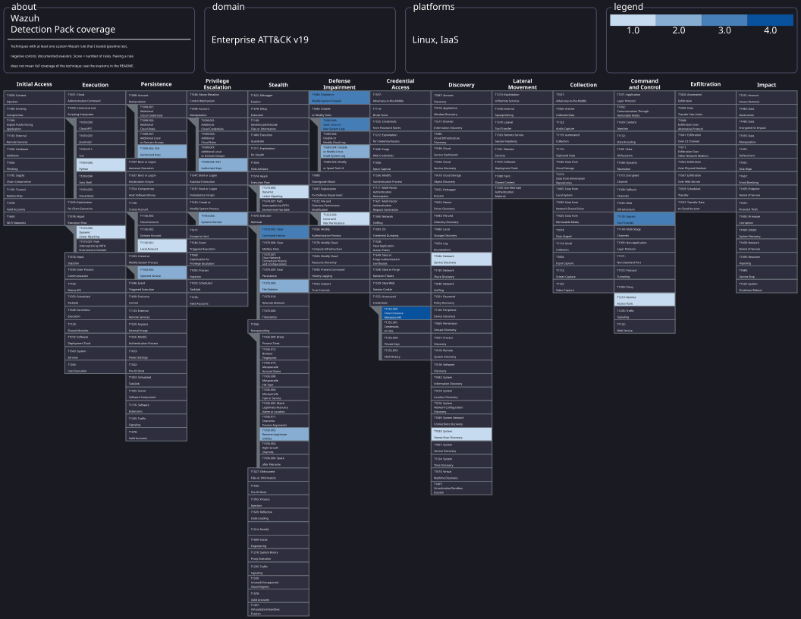

The image is the SVG export from ATT&CK Navigator. The Navigator export has no background, so I added a dark one; nothing else in the file was changed.

| Tactic (ATT&CK v19) | Techniques with rules |
|---|---|
| Execution | T1059.006, T1574.006 |
| Persistence | T1098.004, T1136.001, T1543.002 |
| Privilege escalation | T1098.004, T1543.002 |
| Stealth | T1036.003, T1070.003, T1070.004, T1574.006 |
| Defense impairment | T1222.002, T1685.004, T1685.006, T1686 |
| Credential access | T1552.005 |
| Discovery | T1033, T1046 |
| Command and control | T1105, T1219 |

**ATT&CK v19 changed some ids.** In April 2026 MITRE retired the Defense Evasion tactic and split it into Stealth and Defense Impairment, and revoked several techniques. I checked every id against the official v19.2 data (`enterprise-attack.json`) and three of mine were revoked:

| Id in my rules | Technique | Replaced in v19 by |
|---|---|---|
| T1562.004 | Disable or Modify System Firewall | T1686 |
| T1562.012 | Disable or Modify Linux Audit System | T1685.004 (Disable or Modify Linux Audit System Log) |
| T1070.002 | Clear Linux or Mac System Logs | T1685.006 |

The layer uses the v19 ids. The rules in `local_rules.xml` still carry the old ones, because Wazuh 4.14 ships its own copy of the ATT&CK ids. I did not test whether Wazuh accepts the new ids, so I left the rules as they are for now.

What this matrix does not say: a colored cell means I wrote and tested a rule for that technique, not that the technique is covered. Each technique has many ways to be done and every rule has documented evasions. Counting rules per technique is also a weak signal, since three rules for one technique can be three views of the same event. It is a map of what I worked on, not a coverage score.

Learning value: building the layer from the rules instead of by hand showed me a problem I would not have seen otherwise, which is that the framework itself changes under the rules. Detection content needs maintenance against a moving taxonomy.

### Sigma versions

Three of my detections also exist as vendor-neutral [Sigma](https://github.com/SigmaHQ/sigma) rules in [`sigma/`](sigma/). Sigma is a YAML format that describes a detection once, and a converter (sigma-cli with pySigma) turns it into the query language of a given SIEM. The idea is that the logic is not trapped inside Wazuh XML.

Before writing anything I searched the SigmaHQ repository. Two of my topics were already covered: `/etc/ld.so.preload` (rule `4b3cb710`, which is basically my 100180) and systemd service creation (`1bac86ba`, CREATE events only). I did not copy the first one. For the second I wrote a complement and said so in the rule. Nothing in SigmaHQ covers `authorized_keys`, and the existing history rule looks at command lines, not at the file.

| Sigma file | Wazuh rule | ATT&CK | What it adds or differs |
|---|---|---|---|
| `lnx_auditd_ssh_authorized_keys_replaced.yml` | 100160 | T1098.004 | No equivalent upstream. Covers create and delete, including `sed -i` style rename-over |
| `lnx_auditd_systemd_unit_deleted_or_created.yml` | 100170 | T1543.002 | Adds DELETE and restricts to unit suffixes. Complements `1bac86ba` |
| `lnx_auditd_shell_history_deleted.yml` | 100200 | T1070.003 | Looks at the file event, so `history -w` (temp file plus rename) fires without a visible command |

What I checked: `sigma check` reports 0 errors and 0 issues on the three files, and `sigma convert` produces queries for Splunk and for Elasticsearch (Lucene). I ran the check with the two MITRE tag validators excluded (`-x attacktag -x d3_fendtag`) because they download data from the internet and my sandbox blocked it, so I checked the technique IDs by hand. I converted without a field-mapping pipeline, so the output uses the raw auditd field names; a real deployment would need a pipeline for its own schema. I did not run these queries against a live Splunk or Elastic.

What does not translate, and why I left it out:

- **100190 and 100191** (log deletion and truncation) depend on `auid` not being unset, and 100191 tests a bit in the open flags. Those live in different audit records of the same event (SYSCALL and PATH), and Sigma matches record by record.
- **In-place changes** (`echo key >> authorized_keys`, editing a unit without replacing it) produce neither CREATE nor DELETE. Only the Wazuh rules catch them, so the Sigma versions are narrower on purpose.
- **The auditd watches themselves** are not part of Sigma. Each rule says in its description which `-w` watch it needs.

Learning value: writing the Sigma version forced me to ask which parts of a detection are the idea and which are Wazuh plumbing. That boundary is not obvious until you try to move the rule somewhere else.

### Hypotheses not tested yet

| Maneuver | Rule that should see it | Status |
| --- | --- | --- |
| Copy to `/home/ubuntu`, run from there | Only 100101 (the copy) | Hypothesis |
| `cd /usr/bin; cp whoami /tmp/x` (relative path) | 100101 probably not (regex expects `/usr/bin/...`); 100102 yes when run from `/tmp` | Hypothesis |
| `cat /usr/bin/whoami > /tmp/x` then `chmod +x` | 100101 no; 100102 yes when run from `/tmp` | Hypothesis |
| Same, but running it from `/home/ubuntu` | None (full evasion) | Hypothesis |
| Legitimate `#!` script run from `/tmp` | 100102 (false positive). Check which `exe` auditd records | To measure |
| `echo $USER` | Probably nothing (shell builtin, no `execve`) | Hypothesis |

### How to reproduce

1. **AWS.** Create a budget alert first. Launch the standard **Ubuntu Server 24.04 LTS** AMI from Canonical (avoid the variants with SQL Server, Ubuntu Pro or Deep Learning, which add cost or software you do not need). Put both instances in one security group with the rules above.
2. **Server.** Official quickstart (all-in-one):
   ```bash
   curl -sO https://packages.wazuh.com/4.14/wazuh-install.sh && sudo bash ./wazuh-install.sh -a
   ```
   Save the generated admin password somewhere safe. If `apt` returns 404 errors on a fresh instance, run `sudo apt update` first.
3. **Endpoint agent.** Use the dashboard's "Deploy new agent" wizard (Linux, DEB amd64) with the server's **private IP**.
4. **auditd on the endpoint.**
   ```bash
   sudo apt update && sudo apt -y install auditd
   sudo systemctl enable --now auditd
   sudo tee /etc/audit/rules.d/wazuh-cmds.rules > /dev/null <<'EOF'
   -a always,exit -F arch=b32 -S execve -F auid=1000 -F auid!=-1 -k audit-wazuh-c
   -a always,exit -F arch=b64 -S execve -F auid=1000 -F auid!=-1 -k audit-wazuh-c
   EOF
   sudo augenrules --load
   sudo auditctl -l
   ```
   Check your UID first with `id` (the rules assume 1000).
   To also audit PID 1 and everything that starts before auditd, put `audit=1` and `audit_backlog_limit=8192` on the kernel command line (findings 12 and 21):
   ```bash
   echo 'GRUB_CMDLINE_LINUX="$GRUB_CMDLINE_LINUX audit=1 audit_backlog_limit=8192"' | sudo tee /etc/default/grub.d/99-audit.cfg
   sudo update-grub && sudo reboot
   ```
5. **Tell the agent to read the audit log.** If `grep audit /var/ossec/etc/ossec.conf` returns nothing, add this block next to the other `<localfile>` entries and restart the agent:
   ```xml
   <localfile>
     <log_format>audit</log_format>
     <location>/var/log/audit/audit.log</location>
   </localfile>
   ```
6. **Rules on the server.** Append the rules to `/var/ossec/etc/rules/local_rules.xml`, then `sudo /var/ossec/bin/wazuh-analysisd -t` and `sudo systemctl restart wazuh-manager`.
7. **Test** on the endpoint and look for `rule.id:(100100 or 100101 or 100102)` in Threat Hunting.

### Troubleshooting notes

- **SSH `Connection timed out`:** the security group did not match my current public IP. My ISP rotates addresses, so I opened the provider's `/24` for SSH and HTTPS only.
- **`UNPROTECTED PRIVATE KEY FILE` on Windows:** fixed with `icacls ... /inheritance:r` and `/grant:r`, leaving read access to my user only.
- **`apt` 404 on a fresh instance:** stale package index. `sudo apt update` fixed it.
- **A rule file edited by hand in nano got damaged:** discarded the unsaved changes, and kept timestamped backups from then on.

### Cost control

Stop both instances after each session (a stopped instance does not bill compute, but the disk keeps billing), watch the budget alert, and terminate instances and volumes when the project ends.

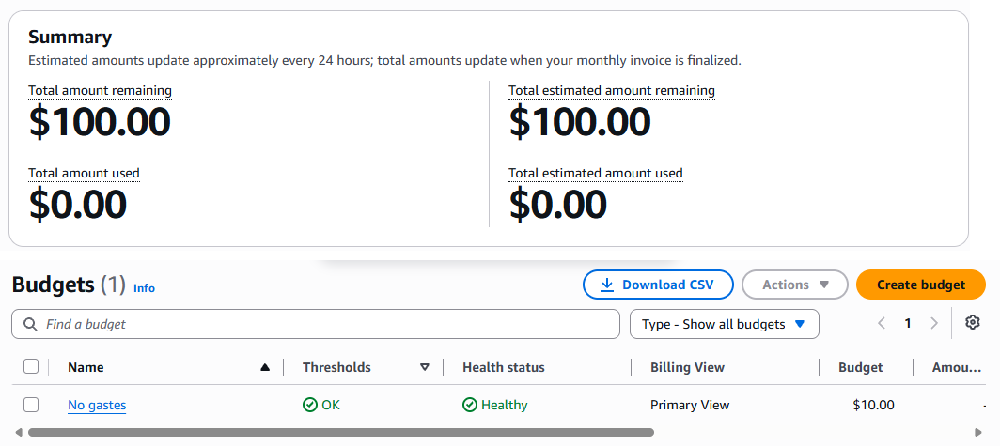

### Security hygiene

- The `.pem` key never goes into a repository (`.gitignore` covers `*.pem`).
- No passwords, account IDs or public IPs in this repo.
- Backup before editing rule files, and validate before restarting.

### How I worked

I used an AI assistant as a guide while building this and treated its output as a claim to verify. Where it mattered I checked the primary source (Wazuh docs, attack.mitre.org). That check is what surfaced the missing `w`/`who` coverage and the naming mismatch above.

### Roadmap

- [x] Wazuh server and Linux endpoint with auditd telemetry
- [x] Four custom rules (phase 1) with positive, negative and evasion tests
- [ ] Run the untested hypotheses above and document the results
- [x] Pick a threat group relevant to Linux (TeamTNT)
- [ ] Core techniques: 10 of 10 have rules (T1105, T1552.005, T1046 and T1219, firewall, `chattr`, local accounts, `authorized_keys`, systemd services, `/etc/ld.so.preload`, log deletion, shell history)
- [x] File-based techniques: `authorized_keys`, systemd services, `/etc/ld.so.preload` and log deletion
- [x] Coverage matrix in ATT&CK Navigator (layer in `navigator/`, ATT&CK v19 ids)
- [x] Convert 2 or 3 rules to Sigma (three in `sigma/`, validated and converted to Splunk and Elasticsearch)
- [ ] Rule for the Wazuh API spawning a shell (CVE-2025-24016, fixed in 4.9.1), after reading the original report
- [ ] Windows endpoint with Sysmon (later phase)
- [ ] Per-rule write-up in English

### Evidence

Screenshots live in [`evidence/`](evidence/):
Screenshots are cropped to the alert table so no IPs or account data show. One file per rule group, named after the rule IDs it shows (for example `100180-ld-so-preload.png`), plus `attack-navigator-coverage.svg`, `agent-connected.png` and `aws-cost-control.png`.

### Sources

- [Wazuh quickstart](https://documentation.wazuh.com/current/quickstart.html)
- [Wazuh: Monitoring system calls, configuration](https://documentation.wazuh.com/current/user-manual/capabilities/system-calls-monitoring/audit-configuration.html)
- [Wazuh PoC: Monitoring execution of malicious commands](https://documentation.wazuh.com/current/proof-of-concept-guide/audit-commands-run-by-user.html) (the auditd approach is adapted from here)
- [MITRE ATT&CK T1033: System Owner/User Discovery](https://attack.mitre.org/techniques/T1033/)
- [MITRE ATT&CK T1036.003: Rename Legitimate Utilities](https://attack.mitre.org/techniques/T1036/003/)
- [MITRE ATT&CK G0139: TeamTNT](https://attack.mitre.org/groups/G0139/)
- [Unit 42: Hildegard, new TeamTNT cryptojacking malware targeting Kubernetes](https://unit42.paloaltonetworks.com/hildegard-malware-teamtnt/)
- [MITRE ATT&CK T1105: Ingress Tool Transfer](https://attack.mitre.org/techniques/T1105/)
- [MITRE ATT&CK T1552.005: Cloud Instance Metadata API](https://attack.mitre.org/techniques/T1552/005/)
- [MITRE ATT&CK T1046: Network Service Discovery](https://attack.mitre.org/techniques/T1046/)
- [MITRE ATT&CK T1219: Remote Access Tools](https://attack.mitre.org/techniques/T1219/)
- [Wazuh ruleset: 0850-audit_rules.xml (v4.14.8), where rule 92600 lives](https://github.com/wazuh/wazuh/blob/v4.14.8/ruleset/rules/0850-audit_rules.xml)

### License

MIT.

---

## Español

Un laboratorio personal para aprender ingeniería de detección en Wazuh, de punta a punta. Leo qué hace un adversario, lo convierto en una regla, compruebo que dispara, compruebo que se calla con actividad normal y dejo escrito cómo alguien podría evadirla.

Esto es trabajo de laboratorio, no de producción ni de clientes, y no tiene relación con Wazuh.

Estado: la fase 1 está terminada (infraestructura y 4 reglas propias validadas). La fase 2, con reglas guiadas por un grupo de amenaza (TeamTNT), está en curso: 10 de 10 técnicas tienen reglas y hay 28 reglas de la fase 2 escritas. Ver la [hoja de ruta](#hoja-de-ruta).

### Qué muestra este proyecto

- Un despliegue funcional de Wazuh 4.14.8 en AWS con un endpoint Ubuntu monitoreado (telemetría de auditd).
- Treinta y dos reglas propias de Wazuh mapeadas a MITRE ATT&CK hasta ahora, cada una con prueba positiva, prueba negativa y una evasión documentada.
- Un hueco en el ruleset de Wazuh: una regla de fábrica de nivel 0 silencia toda ejecución de Python. Lo encontré porque el evento estaba en auditd y nunca llegaba al dashboard (ver [El hueco de Python](#el-hueco-de-python)).
- Errores que detecté al contrastar afirmaciones con la fuente primaria o con mis propias pruebas, incluidas predicciones que me salieron mal (ver [Hallazgos](#hallazgos) y [Hallazgos de la fase 2](#hallazgos-de-la-fase-2)).
- Qué se le escapa a cada regla y dónde da falsos positivos.
- Tres de las detecciones reescritas como reglas Sigma portables, después de revisar qué cubre ya SigmaHQ (ver [Versiones en Sigma](#versiones-en-sigma)).

### Arquitectura del lab

```
 Endpoint (Ubuntu 24.04)                         Servidor (Ubuntu 24.04)
 auditd + agente Wazuh --- 1514/1515 (IP privada) --->  Wazuh 4.14.8 all-in-one
 endpoint-linux-01                                      manager + indexer + dashboard
                                                                 ^
                                  dashboard (443) y SSH (22): solo el /24 de mi proveedor
```

| Componente | Detalle |
| --- | --- |
| Nube | AWS, us-east-1, pagado con crédito de la cuenta |
| Servidor | Ubuntu Server 24.04 LTS, t3.xlarge (4 vCPU, 16 GB), 50 GiB gp3 |
| Wazuh | 4.14.8 all-in-one, instalado con el asistente oficial |
| Endpoint | Ubuntu Server 24.04 LTS, agente Wazuh 4.14.8, nombre `endpoint-linux-01`, instancia chica (clase t3.small), 20 GiB gp3 |
| Agente al servidor | Por la **IP privada** del servidor, que no cambia al detener y prender las instancias |
| Telemetría | Linux Audit (`auditd`), llamadas `execve` de mi usuario, leídas por el agente desde `/var/log/audit/audit.log` |
| Control de costos | AWS Budget con alerta por email, creado antes de lanzar nada |


#### Decisiones de red (security group)

- SSH (22) y HTTPS (443): solo desde el bloque `/24` de mi proveedor. Mi IP pública cambió entre tres direcciones distintas del mismo bloque en menos de dos horas, y una `/32` me dejaba afuera cada rato. Es un compromiso consciente: menos estricto que `/32`, mucho más cerrado que `0.0.0.0/0`.
- 1514-1515 (agentes): solo desde el propio security group.
- Nunca `0.0.0.0/0`.

### Reglas

Todas cuelgan de la regla de fábrica **80792** ("Audit: Command") de Wazuh, que clasifica cualquier comando bajo la clave `audit-wazuh-c`. Esa regla base no tiene mapeo a MITRE y no distingue un `ls` inocente de algo sospechoso, así que las reglas propias agregan ese contexto.

| ID | Nivel | Qué detecta | ATT&CK |
| --- | --- | --- | --- |
| 100100 | 8 | `whoami`, `id`, `w`, `who` (descubrimiento de usuario) | T1033 |
| 100101 | 10 | `cp`, `mv` o `ln` sobre esos binarios (preparar una copia para renombrarla) | T1036.003 |
| 100102 | 7 | Cualquier binario ejecutado desde `/tmp`, `/var/tmp` o `/dev/shm` | T1036.003 |
| 100103 | 3 | Los mismos cuatro comandos ejecutados como root sin terminal (ruido de login, bajada de nivel y no silenciada) | ninguno |

Archivo completo: [`rules/local_rules.xml`](rules/local_rules.xml). El XML de las tres reglas está desplegable en la sección en inglés.


#### Decisiones de diseño

- IDs propios en el rango 100000-119999, para no chocar nunca con las reglas de fábrica.
- Nivel 8 para la 100100, no 12: un `whoami` aislado es un indicio, no una prueba de compromiso.
- `auid` y no `uid` en la regla de auditd: `auid` es el usuario de la sesión y se mantiene con `sudo`, así que escalar privilegios no esconde el comando.
- Flujo antes de cada cambio: backup de `local_rules.xml`, validación con `/var/ossec/bin/wazuh-analysisd -t` y recién después reinicio del manager.

### Resultados de validación

| Prueba | Resultado |
| --- | --- |
| `whoami`, `id` | Dispara la 100100 |
| `ls`, `date` | No dispara. Control: la regla base 80792 sí disparó, o sea que los eventos llegaron al servidor |
| `who`, `w` | Dispara la 100100 (tras ampliar la regla, ver Hallazgos) |
| `cp /usr/bin/id /tmp/idc` | Dispara la 100101 |
| `cp /etc/hostname /tmp/h` | No dispara (prueba negativa) |
| `cp /usr/bin/whoami /tmp/wm`, y después `/tmp/wm` | **No** dispara la 100100 (evasión). Dispara la 100102 |


Un resultado negativo solo vale si un control prueba que el evento llegó. Cada "no dispara" de arriba se contrastó con la regla 80792.

### Hallazgos

1. **Hueco de cobertura en mi primera versión.** La 100100 v1 cubría solo `whoami` e `id`. La página oficial de T1033 también lista `w` y `who` en Linux. La v2 los incluye.
2. **Renombrar rompe una regla basada en el nombre.** En la alerta de `/tmp/wm`, `audit.command` es `wm` y `audit.exe` es `/tmp/wm`. Un filtro por nombre de comando no ve la copia renombrada; la ruta sí. Eso es lo que usa la 100102.
3. **Wazuh y ATT&CK no coinciden en los nombres del mismo ID.**

   | | Wazuh 4.14.8 (alerta) | ATT&CK (página oficial, v19) |
   | --- | --- | --- |
   | Nombre de T1036.003 | Rename System Utilities | Rename Legitimate Utilities |
   | Táctica | Defense Evasion | Stealth (TA0005) |

   El ID coincide, así que el mapeo es correcto. Mi hipótesis, **sin verificar**, es que Wazuh trae un dataset de ATT&CK más viejo. Regla práctica: mapear por ID, nunca por nombre, y contrastar con la fuente primaria.
4. **Ruido de login.** Cada login por SSH, incluso uno no interactivo (`ssh host comando`), ejecutaba `who`, `id` e `id` como root y sin terminal, y la regla 100100 los marcaba en nivel 8 sin que yo hubiera escrito nada. Agregué la 100103, una regla hija que baja a nivel 3 lo que corre como root sin terminal, en vez de silenciarlo. El costo es que alguien que ejecute `sudo id` por una sesión SSH no interactiva también cae en nivel 3. Un comando que escribo yo mismo por SSH sigue disparando la 100100 en nivel 8. Mi suposición es que scripts de login del sistema corren esos comandos; no confirmé cuál es el proceso padre.
5. **La hora de la alerta no es la hora de ejecución.** El `timestamp` de una alerta es cuando el servidor procesó el evento, entre 20 y 30 segundos después del comando en mi lab. La hora real está en el registro de auditd.


### Límites conocidos

- La 100100 marca `id` todas las veces, y scripts y administradores lo corren todo el tiempo. En un entorno real hace ruido. La 100103 solo baja la parte que viene de los scripts de login.
- La 100101 detecta el paso previo (la copia), no el uso del binario renombrado.
- La 100102 tiene falsos positivos (instaladores, `snap`, scripts legítimos) y se evade ejecutando desde otra carpeta.
- Ninguna regla usa todavía `tty` ni `ppid` para separar uso interactivo de scripting.
- Probado en un solo endpoint, solo con mis propios comandos. No medí la tasa de falsos positivos.

### Fase 2: TeamTNT (ATT&CK G0139)

Elegí TeamTNT porque ataca cargas de trabajo Linux y en la nube (Docker expuesto, Kubernetes, credenciales de AWS), que es lo que auditd puede ver en un equipo Linux. La lista de técnicas sale de la página del grupo en ATT&CK (v19) y del análisis de Unit 42 sobre Hildegard, una campaña de TeamTNT. Está en [`phase2/teamtnt-techniques.md`](phase2/teamtnt-techniques.md), junto con lo que mi lab no puede ver. Todavía no verifiqué cada ID contra la página de su técnica.

Para cada técnica escribo lo que espero antes de probar, hago una prueba positiva, una negativa con control y al menos una evasión, y después armo una v2 para las evasiones que puedo cerrar. Cuando una predicción salió mal, la dejé en el informe.

Avance: las 10 técnicas centrales tienen reglas. La mayoría de las reglas cuelgan de la regla de fábrica 80792; las de Python cuelgan de la 92600.

| ID | Nivel | Qué detecta | ATT&CK |
| --- | --- | --- | --- |
| 100110 | 4 | `curl` o `wget` ejecutado (línea base) | T1105 |
| 100111 | 10 | `curl` o `wget` con un directorio temporal en los argumentos, incluidas opciones pegadas a la ruta (`-o/tmp/x`, `--output-document=/tmp/x`) | T1105 |
| 100112 | 8 | `curl` o `wget` ejecutado con un directorio temporal como directorio de trabajo (rutas de salida relativas) | T1105 |
| 100120 | 9 | `curl` o `wget` hacia el servicio de metadatos de la instancia (IP en texto, decimal, hex u octal) | T1552.005 |
| 100121 | 12 | Lo mismo, pidiendo `security-credentials` (las claves del rol de IAM) | T1552.005 |
| 100130 | 3 | Cualquier ejecución de Python (la regla de fábrica las oculta en nivel 0) | T1059.006 |
| 100131 | 9 | Un proceso Python que referencia el servicio de metadatos | T1552.005 |
| 100132 | 12 | Un proceso Python que pide `security-credentials` | T1552.005 |
| 100133 | 10 | `ufw disable` o `ufw reset` (el script de ufw corre como Python) | T1562.004 |
| 100140 | 8 | `masscan`, `zmap`, `zgrab` o `zgrab2` por nombre de binario | T1046 |
| 100141 | 10 | `tmate` por nombre de binario | T1219 |
| 100150 | 5 | `iptables`, `ip6tables` o `ufw` ejecutado | T1562.004 |
| 100151 | 10 | Lo mismo con `-F`, `--flush`, `disable` o `reset`. Con límite de frecuencia: `ignore="60"` | T1562.004 |
| 100152 | 8 | `chattr` ejecutado | T1222.002 |
| 100153 | 8 | `useradd` o `adduser` ejecutado con éxito | T1136.001 |
| 100160 | 10 | Escritura en `authorized_keys` (agregar o reemplazar el archivo) dentro de un directorio `.ssh` vigilado | T1098.004 |
| 100161 | 10 | El directorio `.ssh` mismo movido o borrado | T1098.004, T1070.004 |
| 100162 | 10 | Se quitó una regla de audit con clave Wazuh (watch descartado o auditoría manipulada) | T1562.012 |
| 100163 | 12 | Auditoría apagada (`auditctl -e 0`) | T1562.012 |
| 100170 | 10 | Un archivo de unidad de systemd creado o borrado directamente en `/etc/systemd/system` | T1543.002 |
| 100171 | 6 | `systemctl enable`, `reenable` o `link` | T1543.002 |
| 100180 | 12 | `/etc/ld.so.preload` creado, escrito, reemplazado o borrado | T1574.006 |
| 100190 | 10 | Un archivo directo en `/var/log` borrado o renombrado por una sesión con `auid` real. Limitada con `ignore="60"` | T1070.002, T1070.004 |
| 100191 | 10 | Un archivo directo en `/var/log` abierto con `O_TRUNC` por una sesión con `auid` real | T1070.002 |
| 100192 | 10 | `truncate` o `shred` con una ruta bajo `/var/log` | T1070.002 |
| 100200 | 10 | Un archivo de historial de la shell (`.bash_history`) borrado o renombrado | T1070.003 |
| 100201 | 10 | Un archivo de historial de la shell abierto con `O_TRUNC` | T1070.003 |
| 100202 | 8 | `rm`, `shred`, `truncate`, `ln`, `mv` o `unlink` con un archivo de historial de la shell | T1070.003 |

#### T1105: herramientas descargadas con curl y wget (100110, 100111, 100112)

Un `curl` a secas es normal, así que la 100110 es solo una línea base de nivel 4. El nivel sube cuando los argumentos apuntan a un directorio temporal (100111) o cuando el proceso corre desde uno (100112). URL de prueba: `https://example.com`.


| Prueba | Resultado |
| --- | --- |
| `curl -s -o /tmp/t1 URL` | 100111, nivel 10 |
| `wget -q -O /tmp/t4 URL` | 100111, nivel 10 |
| `curl -s URL` desde mi directorio personal | Solo 100110, nivel 4 |
| `ls /tmp` | Nada. Control: la 80792 sí disparó |
| `cd /tmp && curl -s URL -o t2` | v1: solo 100110. v2: 100112, nivel 8 |
| `curl -s URL -o/tmp/t3` | v1: solo 100110. v2: 100111, nivel 10 |
| `wget -q --output-document=/tmp/t5 URL` | 100111, nivel 10 |
| `curl -s URL > /dev/null` ejecutado desde `/tmp` | 100112, nivel 8 (falso positivo aceptado) |

Lo que la v1 no veía: la 100111 solo reconocía un argumento que empezara con `/tmp/`. Se colaban una ruta de salida relativa con `/tmp` como directorio de trabajo y una opción pegada a la ruta. La v2 amplía el regex para aceptar un prefijo de opción, y la 100112 mira el directorio de trabajo (`audit.cwd`). Es nivel 8 y no 10 porque ejecutar desde `/tmp` es una señal más débil que escribir ahí de forma explícita. Un `curl` que solo imprime en pantalla desde `/tmp` también la dispara, y lo acepté.

Todavía se evade con: salida a un directorio fuera de mi lista (`~/.cache`, `/run/lock`), otros clientes de descarga y un binario renombrado.

#### T1552.005: servicio de metadatos de la instancia (100120, 100121, 100130 a 100132)

En EC2, el servicio de `169.254.169.254` entrega las credenciales temporales del rol de IAM de la instancia. TeamTNT lo usaba para pasar de una shell en un servidor a la cuenta de AWS, así que lo probé en mi instancia real.


| Prueba | Resultado |
| --- | --- |
| `curl http://169.254.169.254/latest/meta-data/` | 100120, nivel 9 |
| Pedido de token de IMDSv2 (`PUT .../api/token`) | 100120, nivel 9 |
| `curl .../iam/security-credentials/` | 100121, nivel 12 |
| `curl https://example.com` | Solo 100110, nivel 4 |
| La misma IP escrita en decimal (`2852039166`) | v1: solo 100110. v2: 100120, nivel 9 |
| Hex (`0xa9fea9fe`) y octal (`0251.0376.0251.0376`) | 100120, nivel 9 |
| Forma mixta (`169.16689662`) | Solo 100110, nivel 4. Evasión residual |
| `urlopen` de Python al servicio de metadatos | v1: ninguna alerta. Ver la sección siguiente |

La instancia ya exigía tokens de IMDSv2: un pedido simple desde Python recibió HTTP 401. Las reglas registran el intento, tenga éxito o no. La prevención real es la configuración de AWS (exigir tokens, hop limit 1), y la detección es la segunda capa.

#### El hueco de Python

El pedido de Python estaba en el log de auditoría (`ausearch` lo mostraba con la clave correcta) y nunca se convirtió en alerta. Cómo lo rastreé:


1. auditd tenía el evento, así que la pérdida estaba en algún punto entre el log y el dashboard.
2. Una prueba controlada de 2x2. `python3 --version` (Python, sin paréntesis) no generó alerta. `ls "(1)"` (paréntesis, sin Python) sí. O sea que era por Python y no por caracteres raros en los argumentos.
3. Busqué la palabra python en el ruleset de fábrica. La regla 92600 de `0850-audit_rules.xml` tiene nivel 0 y coincide con cualquier `audit.exe` que contenga "python". Sus hijas son la 92601 (script ejecutado desde `/tmp`, nivel 6) y la 92602 (firma de Impacket, nivel 12). Wazuh silencia Python genérico a propósito, porque hace ruido, y solo alerta cuando coincide una hija.
4. La solución son reglas que cuelgan de la 92600 y no de mi cadena de curl y wget (100130, 100131, 100132).

| Prueba | Resultado |
| --- | --- |
| `python3 -c "print(1)"` y `python3 --version` | 100130, nivel 3 |
| `python3 -c` con `urlopen` al servicio de metadatos | 100131, nivel 9 |
| Lo mismo, hacia `security-credentials` | 100132, nivel 12 |
| `python3 /tmp/x.py` | La 92601 de fábrica, nivel 6. Confirma que los eventos de Python pasan por esa cadena |

Límite: un script ejecutado desde `/tmp` se reporta como 92601 y no como la regla de metadatos. Además, auditd codifica en hexadecimal los argumentos que llevan espacios, y no sé si el agente los decodifica. Las reglas de Python incluyen la forma en texto y la forma hex de las cadenas que buscan. Dispararon en mis pruebas, pero no comprobé cuál de las dos ramas coincidió.

#### T1046 y T1219: escáneres y tmate (100140, 100141)

No instalé las herramientas reales. Usé copias inofensivas de `/usr/bin/true` con los nombres `masscan`, `zmap` y `tmate`, así que estas pruebas solo demuestran la coincidencia por nombre.


| Prueba | Resultado |
| --- | --- |
| `masscan` y `zmap` | 100140, nivel 8 |
| `tmate` | 100141, nivel 10 |
| Una copia renombrada como `scanner` | Ninguna regla propia, solo la 80792 en nivel 3. Evasión confirmada |
| `ls ~/bin` | Nada de las reglas propias |
| La copia de `masscan` ejecutada desde `/tmp` | 100140 (nivel 8), no 100102 (nivel 7). Mi predicción fue incorrecta |

#### Firewall, chattr y cuentas locales (100150 a 100153)

Tres reglas que coinciden por nombre de comando, así que fueron rápidas de escribir. También fueron las que más me enseñaron sobre cómo un comando se convierte en muchos eventos. En Wazuh 4.14.8 usé `T1562.004` para la técnica del firewall, el ID anterior. ATT&CK v19 la llama `T1686`.


| Prueba | Resultado |
| --- | --- |
| `sudo iptables -F` | 100151, nivel 10, una alerta |
| `sudo iptables -P INPUT ACCEPT` | Solo 100150, nivel 5. Evasión: abre el firewall sin vaciar ni desactivar |
| `sudo iptables -L` | 100150, nivel 5 |
| `sudo ufw disable` | v1: un 100130, unos 100 hits de 100150 y 65 de 100151. v2: un 100133 (nivel 10), un 100151 (nivel 10) y 162 de 100150 (nivel 5, 63 de ellos `-F`) |
| `sudo chattr +i` y `-i` sobre un archivo de prueba | 100152, nivel 8, dos alertas |
| `lsattr` | Nada |
| `sudo useradd ...` | v1: 7 hits en 100153. v2: 1 hit |
| `sudo adduser ...` | v1: 8 hits. v2: 2 hits (`adduser` y el `useradd` real que lanza) |

#### SSH authorized_keys y manipulación de la auditoría (100160 a 100163)

Hasta acá cada regla miraba un comando. Esta mira un efecto: alguien escribe en `authorized_keys`, con la herramienta que sea. Eso necesita un watch de archivo de auditd (`-w <ruta> -p wa -k audit-wazuh-w`). La regla de fábrica 80780 ya mapea esa clave a "acceso de escritura", así que colgué las mías de ahí. Hay una segunda razón para usar un watch: `echo 'clave' >> authorized_keys` es un comando interno de la shell, y el evento salió con `comm=bash` y sin ningún proceso `echo`, así que las reglas que miran comandos nunca lo podían ver.


Mis predicciones antes de probar: el append alerta, la lectura no, y `sed -i` escapa al watch porque reemplaza el archivo en vez de escribirlo. La última era falsa, y también lo fueron algunas posteriores. Están todas en la tabla y en los hallazgos.

| Prueba | Resultado |
| --- | --- |
| `cat authorized_keys` | Nada. El watch es `wa` (escritura y atributos), no lectura |
| `echo 'clave' >> authorized_keys` | 100160, nivel 10 (`openat`, `comm=bash`). Antes de que existiera la regla, las de fábrica daban 80781 en nivel 3 |
| `sed -i` sobre el archivo | 100160, nivel 10 (`rename`). Mi predicción era incorrecta: el watch sí ve el reemplazo del archivo. También leí mal mi propio filtro del dashboard un rato (busqué 80782 y la alerta de fábrica era la 80791) |
| Watch sobre el archivo, después `mv ~/.ssh ~/.ssh.old`, carpeta nueva, `cp`, `echo >>` | El kernel descartó el watch (`CONFIG_CHANGE op=remove_rule` en el log de audit) y nada de lo escrito después quedó registrado. Wazuh solo mostró la 80705 (nivel 3, "Configuration changed"). Evasión confirmada |
| Lo mismo, con un watch sobre el directorio | El movimiento sale como 80791 (nivel 3). El watch queda pegado al directorio viejo: lo que se escribe en el nuevo es invisible, y lo que se escribe en el viejo renombrado sí se registra. Yo había predicho que seguía al directorio nuevo |
| v2: `mv ~/.ssh ~/.ssh.old3` con el watch armado | 100161, nivel 10 |
| v2: `auditctl -W` sobre el watch | 100162, nivel 10. `auditctl -w` (volver a agregarlo) da solo 80705, que es el control negativo |
| `touch` y `rm` de un archivo dentro de `.ssh` | 80790 y 80791, nivel 3. Sin 100161 |
| Watch sobre `/root/.ssh`: append y `sed -i` con `sudo` | 100160 las dos veces (el `auid` sigue siendo 1000 a través de `sudo`) |
| Recargar las reglas con `augenrules --load` (el `-D` del principio de `audit.rules` borra todo primero) | Cuatro 100162 (nivel 10), una por regla quitada, más 80705 por las altas. Es también cómo se vería un `auditctl -D` a mano |
| `auditctl -e 0` | Solo 80705 en nivel 3. Un hueco: la 100162 busca `remove_rule` y esto es otra operación. v2: 100163 (nivel 12) sobre `op=set audit_enabled=0` |
| `auditctl -e 1` con la auditoría ya encendida (control) | Solo 80705, sin 100163 |

Los watches están guardados en `auditd/wazuh-files.rules` (se cargan con `augenrules --load`), junto a `auditd/wazuh-cmds.rules` con las reglas de `execve`. Después de un reinicio `auditctl -l` los mostró todos de nuevo, y otra vez después del cambio de `audit=1` (hallazgo 12).

#### Servicios de systemd (100170, 100171)

TeamTNT dejaba una unidad en `/etc/systemd/system` para sobrevivir a un reinicio. Es la misma familia que `authorized_keys` (se escribe un archivo), con una diferencia: crear el archivo no activa nada. Eso lo hace un segundo paso, `systemctl enable`, que toca otros lugares.


Mis predicciones: el archivo de la unidad alerta en nivel 10, `systemctl enable` solo aparece como comando en nivel 3, el symlink que crea `enable` es invisible (supuse que porque los watches por directorio no son recursivos, y esa razón estaba equivocada, ver hallazgo 12), y una unidad de usuario en `~/.config/systemd/user/` escapa a todo. Los cuatro resultados se cumplieron, pero la razón que di para el symlink estaba equivocada.

| Prueba | Resultado |
| --- | --- |
| `sudo tee /etc/systemd/system/testtnt.service` | 100170, nivel 10. `tee` es un proceso real, así que las reglas de comandos también lo vieron en nivel 3 |
| `systemctl daemon-reload` y `systemctl enable` | Solo 80792 en nivel 3, el comando. `ausearch` encontró 0 líneas del symlink en `multi-user.target.wants/`, o sea que auditd nunca lo registró. Primero lo leí como "los watches de directorio no son recursivos", y estaba equivocado (hallazgo 12): sin `audit=1` en la línea de comandos del kernel, el symlink que crea systemd (PID 1) no se audita en absoluto |
| Evasión: una unidad en `~/.config/systemd/user/`, escrita con `printf >` y habilitada con `systemctl --user enable` | Sin 100170. Solo 80792 en nivel 3. Evasión confirmada |
| v2: `sudo systemctl enable` | 100171, nivel 6 |
| v2: `systemctl --user enable` | 100171, nivel 6, en la segunda ejecución. La primera llegó a auditd y nunca se convirtió en alerta (hallazgo 13) |
| Control: `systemctl --user is-enabled` | Solo 80792, sin 100171 |
| `systemctl disable`, de usuario y de sistema | Sin 100171 |
| `sudo rm /etc/systemd/system/testtnt.service` | 100170, nivel 10. La regla compara el nombre del archivo y no distingue una creación de un borrado |
| Ruido | Cada llamada a `systemctl --user` registra también los ayudantes de systemd (`30-systemd-environment-d-generator`, `systemd-xdg-autostart-generator`) como 80792 en nivel 3 |

#### /etc/ld.so.preload (100180)

El enlazador dinámico lee este archivo y carga cada librería que figura ahí en todos los procesos que arrancan, así que una sola línea hace que cada programa de la máquina ejecute el código del atacante. Es la técnica 9 de mi lista de TeamTNT (T1574.006, Dynamic Linker Hijacking). En un Ubuntu 24.04 limpio el archivo no existe, lo que hace que cualquier cambio sea raro y permite que la regla use un nivel alto.


Mis predicciones: auditd acepta un watch sobre un archivo que todavía no existe, crearlo alerta, el watch sobrevive a un borrado y una recreación, y reemplazar el archivo con `mv` se sigue viendo. Las cuatro se cumplieron. La quinta cosa no la predije: las reglas stock ya alertaban, en nivel 3.

| Prueba | Resultado |
| --- | --- |
| `auditctl -w /etc/ld.so.preload` con el archivo ausente | Aceptado (salida 0), aparece en `auditctl -l` |
| `sudo touch` (crear), antes de la regla | 80790, nivel 3 |
| `: > /etc/ld.so.preload` (truncar), antes de la regla | 80781, nivel 3. Truncar no registra ni CREATE ni DELETE |
| `rm` y otro `touch`, antes de la regla | 80791 y 80790, nivel 3. El watch siguió funcionando |
| Las mismas operaciones con la 100180 cargada: `touch`, truncar, `mv` de un temporal encima, `sed -i`, `rm` | Cinco eventos en auditd, cinco alertas de 100180 en nivel 12, sin alerta stock al lado |
| Evasión: escribir `/tmp/lsp` y hacerle `mv` encima | 100180. El evento tiene tres registros `PATH` con el nombre: `CREATE` para el archivo nuevo y `DELETE` para el viejo y para el temporal |
| Evasión: `sed -i` | 100180. `sed` arma su temporal dentro de `/etc` y lo renombra encima del original |
| Control: `touch` y `rm` de `/etc/ld.so.preload.bak` | Nada. No está vigilado y la regex pide el nombre exacto |
| Reinicio con el watch en `wazuh-files.rules` | `auditctl -l` mostró las dos reglas `execve` y los cuatro watches, `auditd` y el agente estaban activos |

#### Borrado de logs (100190 a 100192)

Técnica 10 de mi lista de TeamTNT: borrar o vaciar logs para esconder lo que pasó (T1070.002, borrado de logs del sistema Linux, y T1070.004, borrado de archivos). El watch es sobre el directorio: `-w /var/log -p wa`.


Esta fue una lección de lo poco que dice el lado de los archivos. Un watch de directorio registra cada apertura para escritura de sus archivos directos, así que las reglas stock ya alertan `touch`, `tee -a`, `truncate`, `mv` y `rm`, todo en nivel 3, y nada separa a un atacante de `apt` o de un login. Lo medí: en unos 5 minutos de trabajo normal de administración (un `logrotate` forzado, un `apt install` y `remove`, un login SSH) el watch registró 181 eventos con `auid` real, y solo los demonios (`rsyslogd`, `sysstat`) lo tenían sin definir. O sea que el `auid` solo es un mal filtro. El propio login (`sshd`) trae el `auid` del usuario. Lo que separa los casos es la operación: `dpkg`, `sshd` y `rsyslogd` solo abren archivos, mientras que borrar, renombrar y truncar vino de `logrotate` (99 `rename` y 4 `unlink` en una corrida forzada) y 2 `unlink` de `apt-get`. Por eso las reglas piden un `auid` real más una operación destructiva.

Tres reglas, porque hay un hueco que no se puede cerrar del lado de los archivos: `truncate -s 0` abre el archivo con `O_WRONLY|O_CREAT|O_NONBLOCK` (`a2=841`, sin `O_TRUNC`) y lo vacía con una llamada aparte, `ftruncate`, y el watch solo registra la apertura. La 100190 es borrar y renombrar, la 100191 es una apertura con `O_TRUNC` (el bit `0x200` de `a2`, comparado en el hexadecimal crudo) y la 100192 es la regla de comando para `truncate` y `shred`.

Mis predicciones fallaron dos veces. Esperaba que el watch de directorio no viera el truncado ni el append, y esperaba que `sshd` no tuviera un id de usuario. También dije que `O_TRUNC` identificaba el truncado, y es falso para `truncate -s 0`.

| Prueba | Resultado |
| --- | --- |
| `touch` y `tee -a` sobre un archivo de prueba en `/var/log` | Solo las stock 80790 y 80781, nivel 3. Ninguna regla nueva |
| `truncate -s 0` | 100192, nivel 10, por el comando. Del lado del archivo se registró una apertura con `a2=841` y quedó en 80781, nivel 3 |
| `sh -c ': > archivo'` | 100191, nivel 10. Apertura con `O_TRUNC` |
| `mv` del archivo a otro nombre en el mismo directorio | 100190, nivel 10 |
| `rm` del archivo, 65 segundos después de la 100190 anterior | 100190, nivel 10 |
| `logrotate -f`, 65 segundos después de la 100190 anterior, unas 100 operaciones destructivas | Una alerta de 100190, nivel 10. No conté en qué se convirtió el resto |
| `apt-get install` y `remove` | Ninguna regla nueva. El `unlink` de `/var/log/apt/eipp.log.xz` quedó en 80791, nivel 3, porque la regex solo toma archivos directos de `/var/log` |
| Primer intento, todos los comandos dentro de 20 segundos | Alertó solo el `mv`. `ignore="60"` silenció el `rm` y el `logrotate`. Mi prueba estaba mal armada y la repetí con pausas de 65 segundos |

#### Historial de la shell (100200 a 100202)

La segunda mitad de la técnica 10: esconder lo que escribió un intruso borrando el historial de la shell (T1070.003). Empecé por ver qué hace la shell con el archivo, antes de escribir nada, con una shell interactiva anidada y un archivo de prueba (`~/.testtnt_hist`) para no tocar mi propio historial.


El resultado es que casi todas las formas no dejan nada para detectar. `history -c` solo limpia la sesión en memoria: el `.bashrc` de Ubuntu activa `histappend`, así que las líneas viejas quedan en el archivo y solo se pierden los comandos de esa sesión. `unset HISTFILE` y matar la shell con `kill -9 $$` también evitan que los comandos lleguen al archivo. Ninguno de los tres deja un evento, porque son comandos internos de la shell o una señal: sin `execve`, sin archivo abierto. Lo que Wazuh sí puede ver es la destrucción de un historial que ya existe. Para eso puse watches sobre `/home/ubuntu/.bash_history` y `/root/.bash_history`. Un logout normal produjo dos eventos de `bash`, un `openat` con `O_WRONLY|O_APPEND` y un `chown`, así que alertar por borrado y por `O_TRUNC` no dispara en un logout. Las tres reglas siguen el mismo reparto que las de logs: 100200 para borrado y renombrado, 100201 para una apertura con `O_TRUNC`, y 100202 para el comando, que es la única capa que ve `truncate -s 0` (abre sin `O_TRUNC`). `cp` no está en la lista de comandos a propósito, porque una copia de respaldo del historial alertaría.

Mis predicciones se cumplieron salvo una: esperaba que `history -w` alertara como truncado (100201) y salió como 100200.

| Prueba | Resultado |
| --- | --- |
| Shell anidada, `echo uno; echo dos` | El archivo guarda las dos líneas |
| `history -c` | El archivo conserva las líneas viejas, solo se pierden los comandos de la sesión. Sin evento |
| `unset HISTFILE`, `kill -9 $$` | Los comandos no se guardan. Sin evento |
| `truncate`, `shred -u`, `ln -s /dev/null`, `rm` sobre el archivo de prueba, antes de las reglas | Solo 80792, nivel 3 |
| Un logout normal con el watch activo | Dos eventos de `bash` (apertura para append, `chown`). No dispara ninguna regla |
| `: > ~/.bash_history` | 100201 |
| `truncate -s 0 ~/.bash_history` | Solo 100202 |
| `history -w` | 100200. Predije 100201. El evento de audit es un `rename` de un archivo temporal (`.bash_history-<pid>.tmp`) encima del original, seguido de un `chown` |
| `mv` para afuera y de vuelta | Tres alertas: 100202 por el primer `mv`, 100200 por el movimiento, 100202 por el segundo `mv` (el archivo de historial es su destino) |
| `ln -sf /dev/null ~/.bash_history` | 100200 y 100202 |
| `rm` de ese symlink | 100200 y 100202 |
| `shred -u` | 100200 y 100202, una de cada una aunque `shred` renombra el archivo varias veces |
| `cp -p` para restaurar desde mi respaldo | Sin alerta |

#### Hallazgos de la fase 2

1. **Cuando coinciden dos reglas hermanas, ganó la de nivel más alto.** Había supuesto que gana la primera del archivo. En la primera prueba, `/tmp/masscan` coincidió con la 100102 (nivel 7, más arriba en el archivo) y con la 100140 (nivel 8) y salió como 100140. En la segunda, una copia de `curl` en `/tmp` coincidió con la 100102 (nivel 7) y con la 100110 (nivel 4, más abajo) y salió como 100102. Los dos resultados encajan con "gana el nivel más alto" y ninguno con el orden del archivo. Son dos observaciones, no leí el código del motor y no probé empates.
2. **El ruleset de fábrica tiene puntos ciegos intencionales.** La regla 92600 oculta todo Python. Mirar qué hace el ruleset base con un evento, antes de asumir que llega a mi cadena, me habría ahorrado una ronda.
3. **Aparecieron tres tipos de evasión.** Otra forma de escribir lo mismo (IP decimal, opción pegada a la ruta, ruta relativa), otra herramienta para el mismo trabajo (Python en vez de curl) y renombrar el binario. Solo el primer tipo se cierra con un regex mejor.
4. **Que el evento exista en el origen no significa que exista una alerta.** El log de auditoría es el primer lugar donde mirar cuando algo falta en el dashboard.
5. **Un comando puede ser muchos eventos.** Un solo `useradd` produjo 7 alertas. En el árbol de procesos (`pid` y `ppid`), un proceso tenía seis hijos que auditd también registró como `useradd`. `ausearch -p <pid> -i` mostró qué eran: llamadas `execve` fallidas (`success=no`, `ENOENT`) a `/usr/sbin/sss_cache`, un programa auxiliar que no está instalado en mi instancia. La v2 exige `success=yes`, comparado como texto en el evento crudo porque no había verificado el nombre del campo decodificado. El costo es que un intento fallido de ejecutar una herramienta ya no alerta en esa regla. Solo la apliqué a la 100153.
6. **`ufw disable` necesitó dos arreglos, y uno fue un compromiso.** Una sola ejecución produjo unas 100 alertas de 100150 y 65 de 100151 (nivel 10), casi todas llamadas de `iptables` de la propia ufw. `ufw` es un script de Python, así que su evento aparece bajo la 100130. La regla 100133 cuelga de ahí y reporta `ufw disable` o `ufw reset` como una sola alerta de nivel 10, que es la línea que debería leer un analista. Aparte, agregué `ignore="60"` a la 100151. Resultado para un `ufw disable`: una alerta de 100133, una de 100151 (antes 65) y 162 de 100150, todas hijas del mismo proceso (`ppid`), creadas en unos 40 ms. Los 63 `-F` que `ignore` silenció en la 100151 aparecieron como 100150 en nivel 5, o sea que bajaron de nivel y no se descartaron. Eso es lo que vi en los datos, no leí el código del motor. Los costos: `ignore` se aplica a toda la regla, no por host ni por proceso, así que un `iptables -F` real dentro de la ventana de 60 segundos aparece en nivel 5 en vez de 10. Y no arreglé la 100150: 162 alertas de nivel 5 por un comando de admin es ruido, y decidí dejarlas como contexto para investigar, con la alerta accionable en la 100133. No verifiqué `ignore` en la documentación.
7. **El nombre de archivo decodificado es el primer registro `PATH`, no el archivo.** Un evento de `sed -i` tiene cinco registros `PATH`, y `wazuh-logtest` mostró `audit.file.name` como el directorio padre (`/home/ubuntu/.ssh/`). Una regla que comparara ese campo se habría perdido el reemplazo. Comparar contra el texto crudo (`name="…/.ssh/authorized_keys"`) funcionó, así que las reglas hacen eso. `wazuh-logtest` fue la herramienta que lo mostró: pegás un evento y leés las tres fases.
8. **Un watch sobre una ruta es un watch sobre un inodo.** Los números de inodo lo hicieron visible: el directorio que armé a las 19:14 ahora es `.ssh.old2` (inodo 295508), y el `~/.ssh` vivo es otro (295521). Escribir en el viejo se registra, escribir en el nuevo no. En el watch por archivo el log de audit lo dice explícitamente. Que el kernel lo haya quitado solo cuando se movió el padre es mi lectura de ese registro, no leí el código del kernel. Lo vi con el kernel 7.0.0-1013-aws.
9. **La evasión deja dos huellas, y son eventos distintos.** El movimiento del directorio (100161) y el watch que desaparece (100162). Ninguna repara nada: después de una alerta 100161 el watch está ciego hasta que alguien lo arma de nuevo a mano, y lo que se escriba en el medio se pierde. Escribí reglas para las huellas porque no pude cerrar el hueco en sí.
10. **Un filtro del dashboard escondió una alerta.** En los eventos `CONFIG_CHANGE` Wazuh decodifica `audit.key` como `null`, así que mi filtro `data.audit.key:audit-wazuh-w` nunca mostró las alertas 80705 del watch descartado, y lo llamé hueco antes de revisar por ID de regla. La corrida de logtest corrigió el diagnóstico. Ahora filtro por `rule.id` cuando quiero saber si algo alertó.
11. **Apagar la auditoría queda registrado, volver a encenderla no.** Después de `auditctl -e 0` el log de audit tiene `op=set audit_enabled=0 old=1` y ninguna línea para el `-e 1` que vino después. Mi lectura es que con la auditoría apagada no hay dónde escribir el cambio, no revisé el kernel. Entonces esa alerta es lo último que reporta el endpoint hasta que alguien vuelve a encenderla, y llegó como 80705 en nivel 3 hasta que escribí la 100163. El control real no es una regla: el modo inmutable (`-e 2` al final de las reglas) rechaza el cambio hasta un reinicio. No lo activé en el lab, porque cada cambio de reglas pediría un reinicio.
12. **El symlink de `systemctl enable` era invisible por quién lo crea, no por dónde.** Primero escribí que un watch de directorio no ve adentro de los subdirectorios, y estaba equivocado. Un archivo regular creado en un subdirectorio de `/var/log` o de `/etc/systemd/system` quedó registrado, y también un symlink que hice a mano con `ln -s` dentro de `multi-user.target.wants/`. Lo que no apareció fue el symlink que crea `systemctl enable`, porque el que lo crea es PID 1 (systemd). La evidencia: `/proc/cmdline` no tenía `audit=1`; `systemctl --root=/ enable`, que hace el trabajo dentro del propio proceso `systemctl`, sí quedó registrado; y después de agregar `audit=1` y reiniciar, el `systemctl enable` normal también quedó registrado, con `proctitle=/sbin/init`. Mi lectura es que los procesos que existen antes de que la auditoría esté activa, PID 1 entre ellos, no reciben contexto de auditoría salvo que `audit=1` esté en el arranque, así que lo que hacen no se audita. Ese mecanismo es de memoria y no lo verifiqué en la documentación del kernel. La consecuencia para la detección: en una imagen de nube estándar los watches de archivos no ven lo que systemd hace por su cuenta, y la regla por comando 100171 era la única huella de un enable. Solo probé PID 1, no revisé otros procesos que arrancan antes que auditd.
13. **Reiniciar el manager desconecta al agente, y perdí un evento que no pude explicar.** El log del agente tiene cinco líneas "Lost connection with manager" a las 18:59, 19:26, 19:39, 19:42 y 19:46 UTC. Coinciden, hasta donde puedo reconstruir por el orden de la sesión, con los reinicios del manager después de cada regla. El agente queda desconectado unos 10 segundos o más cada vez. La demora de 20 a 30 segundos que medí en pruebas anteriores puede ser lo mismo, pero es una suposición. Aparte, un `systemctl --user enable` (19:46:47) está en el log de audit con sus argumentos y nunca se convirtió en alerta, mientras que los eventos justo antes y después sí, y el agente ya había reconectado. No encontré la causa. Repetido unos minutos después, alertó. Desde entonces espero unos 30 segundos después de un reinicio antes de probar.
14. **Una regla por comando es barata de escribir y barata de evadir.** La 100171 atrapa `systemctl enable` sin importar dónde esté la unidad, pero no probé crear el symlink a mano con `ln -s`, que no pasa por `systemctl`. Es una segunda capa encima del watch de archivos y no un reemplazo.
15. **Un watch sobre un archivo que todavía no existe funciona, y sobrevive a un borrado y una recreación.** `auditctl -w /etc/ld.so.preload` devolvió 0 en un sistema donde el archivo no está, y la creación, el truncado, el borrado, el `mv` y el `sed -i` posteriores quedaron todos registrados. Los registros de audit listan el directorio padre (`/etc/`) como un item `PARENT`, así que mi lectura es que el kernel mantiene el watch sobre el padre más el nombre. Eso difiere del hallazgo 8, donde lo vigilado era un directorio y lo cambiaron por otro. No leí el código del kernel.
16. **Las reglas stock ya lo veían. Lo que agregué es severidad y un mapeo.** Antes de la 100180 las mismas operaciones alertaban como 80790, 80781 y 80791 en nivel 3, y sus descripciones ya nombraban el archivo. El nivel 3 es donde nadie mira. Además, el archivo que recreé tomó el inode 2986, el que había tenido `testtnt.service` unos minutos antes, así que un número de inode no identifica a un archivo a lo largo del tiempo.
17. **La ventana de `ignore` puede arruinar una prueba.** La 100190 tiene `ignore="60"`. En mi primera corrida disparé `mv`, `rm`, `logrotate` y `apt` dentro de 20 segundos y solo alertó el `mv`. Durante un minuto no hubiera podido distinguir "la regla no funciona" de "la regla está silenciada". La solución fue dejar 65 segundos entre los casos.
18. **El log de audit muestra los flags en hexadecimal sin `0x` y agrega campos legibles al final de la línea.** `a2=841` en la línea cruda es `0x841`, y la línea termina con `SYSCALL=openat AUID="ubuntu"`. Mi primer `grep` de `0x241` se encontró solo a sí mismo, porque auditd también registra los argumentos del `grep`. Una regla sobre los flags de apertura tiene que comparar los dígitos hexadecimales como texto.
19. **Un historial que nunca se escribe no se protege con una regla, sino con configuración.** Las tres formas de evitar que los comandos lleguen al archivo no dejan ningún evento, y lo único detectable es la destrucción de un historial que existe. La telemetría de comandos es un segundo registro que el usuario no puede editar desde la shell, y por eso 100202 y las otras reglas por comando siguen funcionando cuando el historial ya no está, salvo con los comandos internos.
20. **`history -w` alertó como borrado y no como truncado, y yo había predicho lo contrario.** El evento de audit muestra por qué: bash escribe un archivo temporal (`.bash_history-<pid>.tmp`), lo renombra encima de `.bash_history` (un `rename` con `DELETE` del archivo viejo y `CREATE` del nuevo) y después le hace `chown`. Es un reemplazo, no un truncado. El nivel es el mismo (10) y un usuario puede correrlo legítimamente, así que lo cuento como falso positivo conocido. El watch siguió funcionando después del reemplazo, igual que en el hallazgo 15.
21. **`audit=1` solo perdió 61 eventos en el arranque, y una cola más grande lo arregló.** Después de agregar `audit=1`, `auditctl -s` mostraba `lost 61` (antes era 0). No creció cuando forcé un `logrotate`, unos 100 eventos de golpe, y el log del kernel muestra que los registros de auditoría del arranque vienen de systemd cargando programas BPF antes de que `auditd` esté activo. Eso encaja con una cola de solo 64 eventos hasta que `auditctl` la sube a 8192. Agregar `audit_backlog_limit=8192` a la línea de comandos del kernel y reiniciar dio `lost 0`. Es un arranque contra otro arranque y no conté cuántos eventos produce el arranque, así que la causa es la mejor explicación y no una prueba. Los watches de archivos funcionan igual, pero un pack de detección tiene que mirar `lost` en `auditctl -s`: un evento perdido es una detección que no puede existir.

#### Límites de la fase 2

- Las reglas que coinciden por nombre de binario (100140, 100141) se evaden renombrándolo. El comportamiento (muchas conexiones salientes) es una mejor señal, y necesita otra fuente de datos.
- Nada de esto ve un cliente que no sea `curl`, `wget` ni Python. El monitoreo de red, los VPC flow logs, CloudTrail o GuardDuty serían otras capas; mi lab no las cubre.
- Los escáneres se probaron con copias inofensivas, no con las herramientas reales.
- Las reglas de metadatos también reconocen una forma IPv6 y el nombre `instance-data`, pero no las probé.
- Probado solo con mis comandos, en un endpoint. No medí la tasa de falsos positivos.
- Para la técnica del firewall cambié `T1686` (ATT&CK v19) por `T1562.004`, que Wazuh valida. No confirmé que Wazuh rechace `T1686`.
- `iptables -P INPUT ACCEPT` abre el firewall y la 100151 no lo ve.
- La 100133 solo ve `ufw disable` y `ufw reset`. Quien se salta ufw y llama a `iptables` directo pasa por la 100151, que tiene el límite de frecuencia.
- Los watches cubren solo `/home/ubuntu/.ssh` y `/root/.ssh`. Otros usuarios, y un `AuthorizedKeysFile` distinto en `sshd_config`, no están cubiertos.
- Después de reemplazar el directorio el watch queda ciego hasta que se arma de nuevo. La 100161 y la 100162 avisan, no reparan. La respuesta activa de Wazuh podría rearmarlo, pero no lo probé.
- Mientras la auditoría está apagada no se registra nada, y la 100163 es lo último que reporta el endpoint. El modo inmutable (`-e 2`) lo impediría y no lo activé.
- No probé una segunda capa que no dependa de inodos: el monitoreo de integridad de archivos (FIM) de Wazuh.
- La demora entre auditd y la alerta de Wazuh no es constante: 20 a 30 segundos en algunas pruebas y menos de 2 segundos en estas.
- La 100171 solo ve `systemctl`. Un symlink hecho a mano con `ln -s`, `systemd-run` y unidades en otros directorios (`/usr/lib/systemd/system`, `/run/systemd/system`) no se probaron.
- La tasa de falsos positivos de la 100171 no está medida. Las instalaciones de paquetes también llaman a `systemctl enable`.
- La 100180 solo ve el archivo. Una librería también se puede forzar con la variable de entorno `LD_PRELOAD` (por proceso, sin archivo de por medio) o con la ruta de búsqueda de librerías (`/etc/ld.so.conf.d` más `ldconfig`). No probé ninguna de las dos.
- La tasa de falsos positivos de la 100180 no está medida. En este endpoint nada legítimo toca el archivo, otros sistemas pueden ser distintos.
- El `logrotate` programado corre sin sesión (`auid` sin definir), así que las reglas de logs lo saltean. Lo mismo vale para cualquier cosa que un atacante ejecute desde un servicio de systemd o desde un contexto sin `auid`. Lo probé con `systemd-run rm`: el proceso tenía `auid=unset` y solo alertó la regla stock 80791 en nivel 3.
- El límite de la regla de `logrotate` implica que un borrado real dentro de la ventana de 60 segundos posterior a un `logrotate -f` o a otro `rm` aparece en nivel 3 y no en 10.
- La regex de 100190 a 100192 solo toma archivos directos de `/var/log`. El watch en sí también registra archivos de subdirectorios (por ejemplo `/var/log/apt/`, `/var/log/audit/`), y esos solo reciben las alertas stock de nivel 3. No extendí la regex a ellos.
- Historial de la shell: lo que nunca se escribe no se puede detectar. `history -c`, `unset HISTFILE`, `HISTFILE=/dev/null` y matar la shell no dejan evento. 100200 a 100202 solo cubren la destrucción de un archivo de historial que existe, y solo los dos vigilados, `/home/ubuntu/.bash_history` y `/root/.bash_history`. `.zsh_history` y las otras shells están en las regex pero no tienen watch. Redirigir el historial a otro archivo (`HISTFILE=/tmp/x`) no lo probé.
- La 100202 salta con cualquier argumento que nombre un archivo de historial, así que restaurar un historial con `mv respaldo ~/.bash_history` también alerta. `cp` no está en su lista de comandos (una copia de respaldo alertaría), así que `cp /dev/null ~/.bash_history` queda cubierto solo por 100201, y no lo probé.
- Si el archivo de historial supera `HISTFILESIZE`, bash puede reescribirlo al salir, lo que podría disparar 100200 o 100201 en cada logout. Mi archivo es chico y no probé ese caso.
- Cada corrida programada de `logrotate` genera unas cien alertas de nivel 3 de las reglas stock, porque el watch cubre todo `/var/log`.
- `audit=1` cambia lo que registra el log de audit: PID 1 y todo lo que arrancó antes que auditd ahora se audita. No medí el volumen extra de alertas de nivel 3 (por ejemplo de `systemd-journald` escribiendo en `/var/log/journal`), ni repetí las pruebas anteriores con el parámetro activado.

### Cobertura ATT&CK

La capa [`navigator/wazuh-detection-pack-layer.json`](navigator/wazuh-detection-pack-layer.json) se abre en [ATT&CK Navigator](https://mitre-attack.github.io/attack-navigator/) (Open Existing Layer, Upload from local). Marca 17 técnicas que tienen al menos una regla propia; el puntaje es la cantidad de reglas. El script [`navigator/build_layer.py`](navigator/build_layer.py) la arma a partir de las etiquetas `<mitre>` de `rules/local_rules.xml`, así que la capa no se puede desfasar de las reglas.


La imagen es el export SVG de ATT&CK Navigator. El export no trae fondo, así que le agregué uno oscuro; no cambié nada más del archivo.

| Táctica (ATT&CK v19) | Técnicas con reglas |
|---|---|
| Execution | T1059.006, T1574.006 |
| Persistence | T1098.004, T1136.001, T1543.002 |
| Privilege escalation | T1098.004, T1543.002 |
| Stealth | T1036.003, T1070.003, T1070.004, T1574.006 |
| Defense impairment | T1222.002, T1685.004, T1685.006, T1686 |
| Credential access | T1552.005 |
| Discovery | T1033, T1046 |
| Command and control | T1105, T1219 |

**ATT&CK v19 cambió algunos IDs.** En abril de 2026 MITRE retiró la táctica Defense Evasion, la dividió en Stealth y Defense Impairment, y revocó varias técnicas. Revisé cada ID contra los datos oficiales de v19.2 (`enterprise-attack.json`) y tres de los míos estaban revocados:

| ID en mis reglas | Técnica | Reemplazo en v19 |
|---|---|---|
| T1562.004 | Disable or Modify System Firewall | T1686 |
| T1562.012 | Disable or Modify Linux Audit System | T1685.004 (Disable or Modify Linux Audit System Log) |
| T1070.002 | Clear Linux or Mac System Logs | T1685.006 |

La capa usa los IDs de v19. Las reglas de `local_rules.xml` siguen con los viejos, porque Wazuh 4.14 trae su propia copia de los IDs de ATT&CK. No probé si Wazuh acepta los nuevos, así que por ahora dejé las reglas como están.

Lo que esta matriz no dice: una celda coloreada significa que escribí y probé una regla para esa técnica, no que la técnica esté cubierta. Cada técnica se puede hacer de muchas formas y cada regla tiene evasiones documentadas. Contar reglas por técnica es además una señal débil, porque tres reglas para una técnica pueden ser tres vistas del mismo evento. Es un mapa de en qué trabajé, no un puntaje de cobertura.

Valor de aprendizaje: armar la capa desde las reglas y no a mano me mostró un problema que no habría visto de otra forma: el propio marco cambia por debajo de las reglas. El contenido de detección necesita mantenimiento contra una taxonomía que se mueve.

### Versiones en Sigma

Tres de mis detecciones existen también como reglas [Sigma](https://github.com/SigmaHQ/sigma), un formato independiente del proveedor, en [`sigma/`](sigma/). Sigma es un YAML que describe una detección una sola vez, y un conversor (sigma-cli con pySigma) la traduce al lenguaje de consulta de cada SIEM. La idea es que la lógica no quede atrapada dentro del XML de Wazuh.

Antes de escribir nada busqué en el repositorio de SigmaHQ. Dos de mis temas ya estaban cubiertos: `/etc/ld.so.preload` (regla `4b3cb710`, que es básicamente mi 100180) y la creación de servicios de systemd (`1bac86ba`, solo eventos CREATE). La primera no la copié. Para la segunda escribí un complemento y lo aclaro en la propia regla. En SigmaHQ no hay nada para `authorized_keys`, y la regla de historial que existe mira líneas de comandos, no el archivo.

| Archivo Sigma | Regla Wazuh | ATT&CK | Qué agrega o qué cambia |
|---|---|---|---|
| `lnx_auditd_ssh_authorized_keys_replaced.yml` | 100160 | T1098.004 | Sin equivalente en SigmaHQ. Cubre creación y borrado, incluido el reemplazo por rename tipo `sed -i` |
| `lnx_auditd_systemd_unit_deleted_or_created.yml` | 100170 | T1543.002 | Agrega DELETE y limita a sufijos de unidad. Complementa a `1bac86ba` |
| `lnx_auditd_shell_history_deleted.yml` | 100200 | T1070.003 | Mira el evento del archivo, así que `history -w` (archivo temporal más rename) dispara sin que haya un comando visible |

Qué verifiqué: `sigma check` da 0 errores y 0 problemas en los tres archivos, y `sigma convert` genera consultas para Splunk y para Elasticsearch (Lucene). Corrí el chequeo excluyendo los dos validadores de etiquetas MITRE (`-x attacktag -x d3_fendtag`) porque descargan datos de internet y mi sandbox lo bloqueó, así que los IDs de técnica los revisé a mano. Convertí sin pipeline de mapeo de campos, por lo que la salida usa los nombres crudos de auditd; un despliegue real necesitaría un pipeline para su esquema. No ejecuté estas consultas en un Splunk o Elastic de verdad.

Qué no se traduce, y por qué lo dejé afuera:

- **100190 y 100191** (borrado y truncado de logs) dependen de que `auid` no sea unset, y la 100191 prueba un bit de las flags de apertura. Eso vive en registros distintos del mismo evento (SYSCALL y PATH), y Sigma compara registro por registro.
- **Los cambios in situ** (`echo clave >> authorized_keys`, editar una unidad sin reemplazarla) no generan ni CREATE ni DELETE. Solo los atrapan las reglas de Wazuh, por eso las versiones Sigma son más angostas a propósito.
- **Los watches de auditd** no forman parte de Sigma. Cada regla dice en su descripción qué `-w` necesita.

Valor de aprendizaje: escribir la versión Sigma me obligó a preguntarme qué parte de una detección es la idea y cuál es plomería de Wazuh. Ese límite no se ve hasta que intentás llevar la regla a otro lado.

### Hipótesis todavía sin probar

| Maniobra | Regla que debería verla | Estado |
| --- | --- | --- |
| Copiar a `/home/ubuntu` y ejecutar desde ahí | Solo la 100101 (la copia) | Hipótesis |
| `cd /usr/bin; cp whoami /tmp/x` (ruta relativa) | La 100101 probablemente no (el regex espera `/usr/bin/...`); la 100102 sí al ejecutarlo desde `/tmp` | Hipótesis |
| `cat /usr/bin/whoami > /tmp/x` y después `chmod +x` | La 100101 no; la 100102 sí al ejecutarlo desde `/tmp` | Hipótesis |
| Lo mismo, pero ejecutándolo desde `/home/ubuntu` | Ninguna (evasión completa) | Hipótesis |
| Script legítimo con `#!` ejecutado desde `/tmp` | La 100102 (falso positivo). Ver qué `exe` registra auditd | A medir |
| `echo $USER` | Probablemente nada (comando interno de la shell, sin `execve`) | Hipótesis |

### Cómo reproducirlo

1. **AWS.** Crear primero una alerta de presupuesto. Lanzar la AMI estándar **Ubuntu Server 24.04 LTS** de Canonical (evitar las variantes con SQL Server, Ubuntu Pro o Deep Learning, que suman costo o software que no hace falta). Poner las dos instancias en un mismo security group con las reglas de arriba.
2. **Servidor.** Quickstart oficial (all-in-one):
   ```bash
   curl -sO https://packages.wazuh.com/4.14/wazuh-install.sh && sudo bash ./wazuh-install.sh -a
   ```
   Guardar en un lugar seguro la contraseña de admin que genera. Si `apt` da errores 404 en una instancia recién creada, correr antes `sudo apt update`.
3. **Agente del endpoint.** Usar el asistente "Deploy new agent" del dashboard (Linux, DEB amd64) con la **IP privada** del servidor.
4. **auditd en el endpoint.**
   ```bash
   sudo apt update && sudo apt -y install auditd
   sudo systemctl enable --now auditd
   sudo tee /etc/audit/rules.d/wazuh-cmds.rules > /dev/null <<'EOF'
   -a always,exit -F arch=b32 -S execve -F auid=1000 -F auid!=-1 -k audit-wazuh-c
   -a always,exit -F arch=b64 -S execve -F auid=1000 -F auid!=-1 -k audit-wazuh-c
   EOF
   sudo augenrules --load
   sudo auditctl -l
   ```
   Verificar antes tu UID con `id` (las reglas asumen 1000).
   Para auditar también PID 1 y todo lo que arranca antes que auditd, poné `audit=1` y `audit_backlog_limit=8192` en la línea de comandos del kernel (hallazgos 12 y 21):
   ```bash
   echo 'GRUB_CMDLINE_LINUX="$GRUB_CMDLINE_LINUX audit=1 audit_backlog_limit=8192"' | sudo tee /etc/default/grub.d/99-audit.cfg
   sudo update-grub && sudo reboot
   ```
5. **Decirle al agente que lea el log de auditoría.** Si `grep audit /var/ossec/etc/ossec.conf` no devuelve nada, agregar este bloque junto a los otros `<localfile>` y reiniciar el agente:
   ```xml
   <localfile>
     <log_format>audit</log_format>
     <location>/var/log/audit/audit.log</location>
   </localfile>
   ```
6. **Reglas en el servidor.** Agregar las reglas al final de `/var/ossec/etc/rules/local_rules.xml`, y después `sudo /var/ossec/bin/wazuh-analysisd -t` y `sudo systemctl restart wazuh-manager`.
7. **Probar** en el endpoint y buscar `rule.id:(100100 or 100101 or 100102)` en Threat Hunting.

### Notas de troubleshooting

- **SSH `Connection timed out`:** el security group no coincidía con mi IP pública actual. Mi proveedor rota direcciones, así que abrí el `/24` del proveedor solo para SSH y HTTPS.
- **`UNPROTECTED PRIVATE KEY FILE` en Windows:** se resolvió con `icacls ... /inheritance:r` y `/grant:r`, dejando lectura solo para mi usuario.
- **`apt` con 404 en una instancia nueva:** índice de paquetes viejo. `sudo apt update` lo arregló.
- **Un archivo de reglas editado a mano en nano quedó dañado:** descarté los cambios sin guardar y, desde entonces, hago backups antes de editar.

### Control de costos

Detener las dos instancias después de cada sesión (una instancia detenida no cobra cómputo, pero el disco sigue cobrando), vigilar la alerta del presupuesto y borrar instancias y volúmenes al terminar el proyecto.


### Higiene de seguridad

- La clave `.pem` no va nunca a un repositorio (el `.gitignore` cubre `*.pem`).
- Ni contraseñas, ni IDs de cuenta, ni IPs públicas en este repo.
- Backup antes de editar archivos de reglas y validación antes de reiniciar.

### Cómo trabajé

Usé un asistente de IA como guía mientras armaba esto y traté su salida como una afirmación a verificar. Donde importaba, contrasté con la fuente primaria (documentación de Wazuh, attack.mitre.org). Esa verificación fue la que mostró la falta de cobertura de `w` y `who` y la diferencia de nombres de arriba.

### Hoja de ruta

- [x] Servidor Wazuh y endpoint Linux con telemetría de auditd
- [x] Cuatro reglas propias (fase 1) con pruebas positiva, negativa y de evasión
- [ ] Ejecutar las hipótesis sin probar y documentar los resultados
- [x] Elegir un grupo de amenaza relevante para Linux (TeamTNT)
- [ ] Técnicas centrales: 10 de 10 tienen reglas (T1105, T1552.005, T1046 y T1219, firewall, `chattr`, cuentas locales, `authorized_keys`, servicios de systemd, `/etc/ld.so.preload`, borrado de logs, historial de la shell)
- [x] Técnicas basadas en archivos: `authorized_keys`, servicios de systemd, `/etc/ld.so.preload` y borrado de logs
- [x] Matriz de cobertura en ATT&CK Navigator (capa en `navigator/`, IDs de ATT&CK v19)
- [x] Convertir 2 o 3 reglas a formato Sigma (tres en `sigma/`, validadas y convertidas a Splunk y Elasticsearch)
- [ ] Regla para la API de Wazuh lanzando una shell (CVE-2025-24016, corregida en 4.9.1), después de leer el reporte original
- [ ] Endpoint Windows con Sysmon (fase posterior)
- [ ] Ficha por regla, en inglés

### Evidencia

Las capturas están en [`evidence/`](evidence/):
Las capturas están recortadas a la tabla de alertas para que no se vea ninguna IP ni dato de la cuenta. Hay un archivo por grupo de reglas, con el nombre de los IDs que muestra (por ejemplo `100180-ld-so-preload.png`), más `attack-navigator-coverage.svg`, `agent-connected.png` y `aws-cost-control.png`.

### Fuentes

- [Quickstart de Wazuh](https://documentation.wazuh.com/current/quickstart.html)
- [Wazuh: Monitoring system calls, configuración](https://documentation.wazuh.com/current/user-manual/capabilities/system-calls-monitoring/audit-configuration.html)
- [Wazuh PoC: Monitoring execution of malicious commands](https://documentation.wazuh.com/current/proof-of-concept-guide/audit-commands-run-by-user.html) (el enfoque con auditd está adaptado de acá)
- [MITRE ATT&CK T1033: System Owner/User Discovery](https://attack.mitre.org/techniques/T1033/)
- [MITRE ATT&CK T1036.003: Rename Legitimate Utilities](https://attack.mitre.org/techniques/T1036/003/)
- [MITRE ATT&CK G0139: TeamTNT](https://attack.mitre.org/groups/G0139/)
- [Unit 42: Hildegard, nuevo malware de criptominería de TeamTNT contra Kubernetes](https://unit42.paloaltonetworks.com/hildegard-malware-teamtnt/)
- [MITRE ATT&CK T1105: Ingress Tool Transfer](https://attack.mitre.org/techniques/T1105/)
- [MITRE ATT&CK T1552.005: Cloud Instance Metadata API](https://attack.mitre.org/techniques/T1552/005/)
- [MITRE ATT&CK T1046: Network Service Discovery](https://attack.mitre.org/techniques/T1046/)
- [MITRE ATT&CK T1219: Remote Access Tools](https://attack.mitre.org/techniques/T1219/)
- [Ruleset de Wazuh: 0850-audit_rules.xml (v4.14.8), donde está la regla 92600](https://github.com/wazuh/wazuh/blob/v4.14.8/ruleset/rules/0850-audit_rules.xml)

### Licencia

MIT.
